# FlexTaskbar

A portable application launcher for Windows 10 (version 1703 or later) and
Windows 11, for people with a lot of apps installed. You file apps into
categories nested several levels deep (as many as your screen can show,
up to 7). Your categories and pinned apps then
sit in a bar docked against an edge of the screen (by default next to the
Windows taskbar; drag it to the bottom, top, left or right), in the look of the
original FlexTaskbar. Rest the pointer on a category and a flyout pops up with
its subcategories and apps as tiles. Rest on a subcategory and its own flyout
opens beyond it, the same way, as many levels deep as your categories go.
Flyouts always open away from the bar's edge, towards the middle of the screen.
Theme (dark, light or Windows default), colours, transparency, border and
rounded corners are all adjustable. The same categories
are also available from the tray icon, a hotkey menu, and a type-to-search
window.

FlexTaskbar does **not** replace or change the Windows taskbar. By default the
bar sits next to it, on the same edge, and it can be turned off.

- Written in Rust against the native Win32 API. There's no .NET runtime, web
  engine or UI framework to install.
- One `FlexTaskbar.exe` of about 2 MB, with no installer. Settings are kept next
  to the exe.
- Restarts itself after a crash or hang.
- Fully local: no telemetry, no network access of any kind.

> **Status — please read.** This is a complete rewrite of the earlier .NET 8 / WPF
> version, which is still in the git history. It builds for Windows, and its
> core logic has unit tests. The UI was exercised under Wine (see
> [What has been tested](#what-has-been-tested)), but **it has not yet been run on
> a real Windows machine**. Treat it as a first release candidate. If something
> misbehaves, `data\crash.log` next to the exe is the first place to look.

## Screenshots

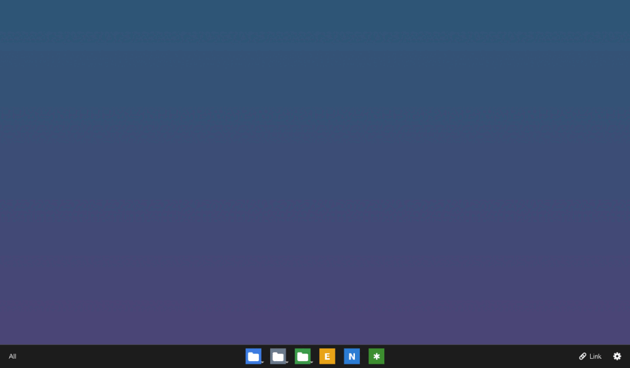

**The bar**: *All* on the left, root categories (marked with an arrow badge) and pinned apps in the
centre, *Link* and settings (⚙) on the right. These are the defaults, which
match the original .NET version.

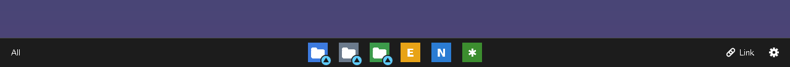

**Any edge**: drag the bar by an empty spot to the left, right, top or bottom.
Its flyouts open towards the middle of the screen, as horizontal strips from a
top or bottom bar and vertical strips from a side bar.

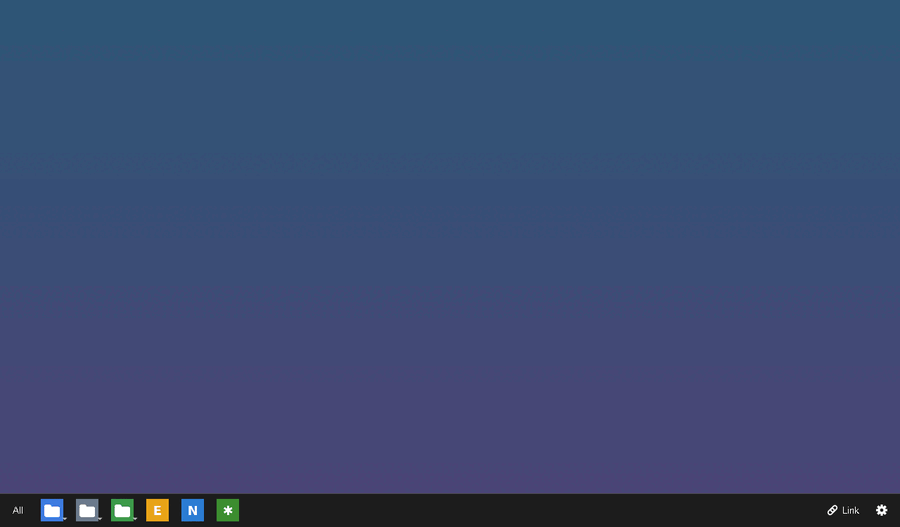

| Left edge: vertical flyouts open to the right | Right edge: vertical flyouts open to the left |
|---|---|
| 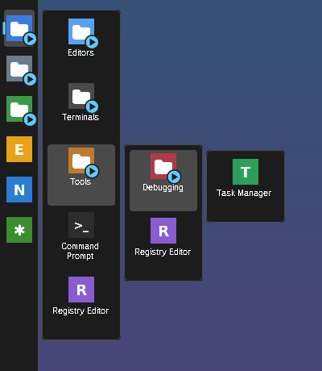 | 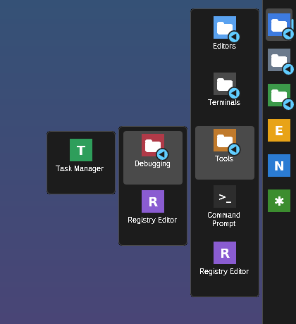 |
| **Top edge: horizontal flyouts open downwards** | |
| 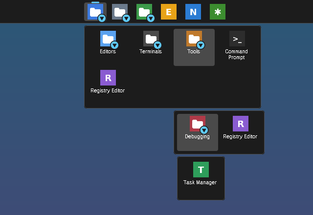 | |

| Hover a category: subcategories and apps as tiles | Hover a subcategory: its flyout floats above |
|---|---|
| 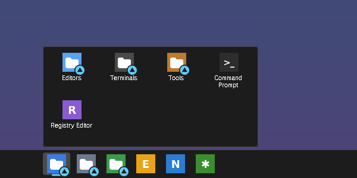 | 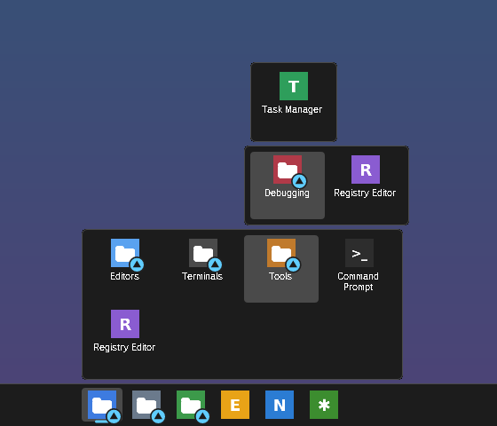 |
| **All: every app** | **Light theme, rounded floating dock** |
| 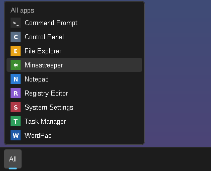 | 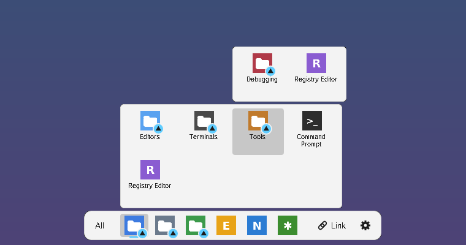 |
| **Drag an icon to rearrange the bar** | **Arrange the bar (from Manage or right-click)** |
| 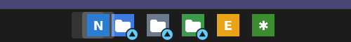 | 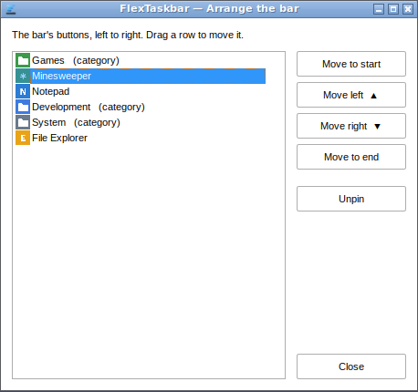 |
| **Appearance window** | **Flyouts with their own corners and border** |
| 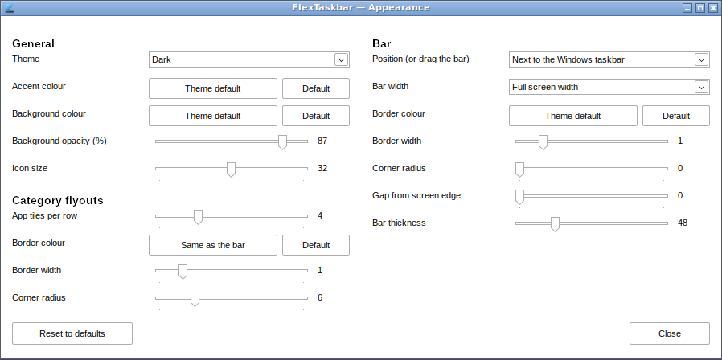 | 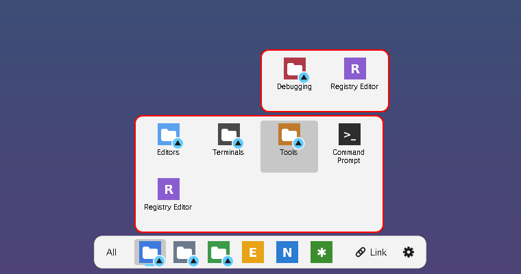 |
| **Right-click: the full menu** | |
| 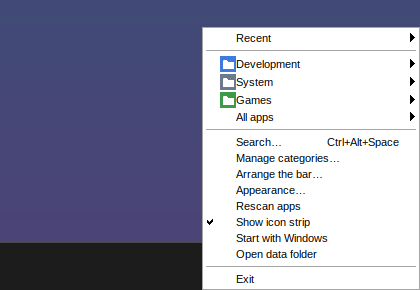 | |
| **Search** | **Custom app (a browser web app)** |
| 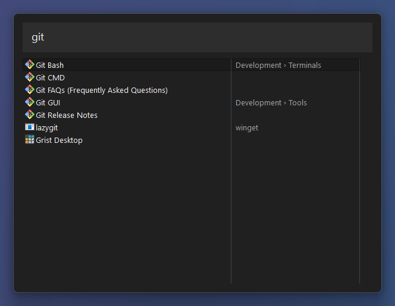 | 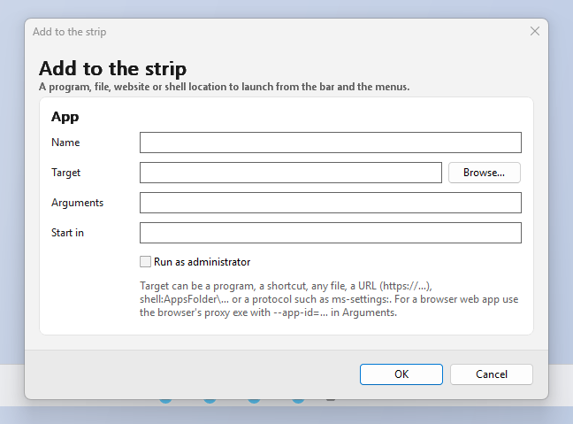 |

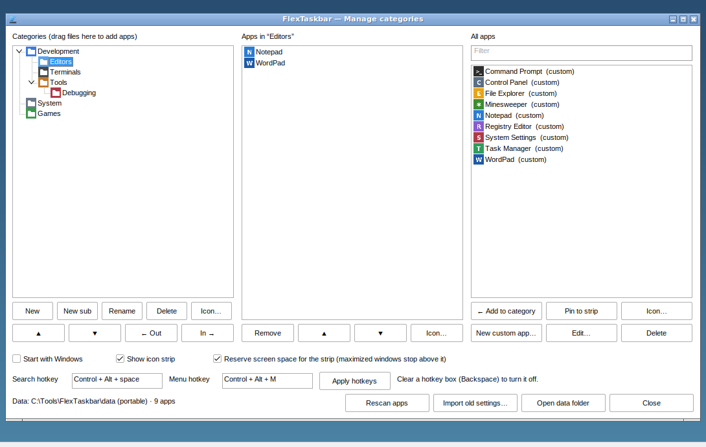

These were captured under Wine on Linux, using a demo setup: Wine's built-in
programs filed into example categories, with custom icons. On Windows you see
your own apps with their real icons, in Windows' own control styling. Wine has
no compositor, so translucent parts of the bar blend against black there; on
Windows they show the desktop behind them.

## Features

**Nested categories.** Categories can contain subcategories, plus
apps. The same app can be filed in several categories. In the tray and hotkey
menu a category is a submenu listing its subcategories, then its apps. From the
bar, a category opens as a flyout (below).

**How deep.** Every level of subcategories opens another flyout, so the nesting
depth follows the screen: as many levels as fit their flyouts, between 3 and 7.
A level counts as two rows of tiles above or below a top or bottom bar, or one
column beside a side bar. For example, a 1920×1080 screen with the bar at the
bottom allows 5 levels (a root category plus 4 levels of subcategories),
2560×1440 allows 7, and a bar on the left or right of a wide screen allows 7.
The Manage window shows the limit above the category tree and won't add or
indent a category past it. Categories already deeper (from an import, or after
switching to a smaller screen) keep working; their flyouts just overlap.

**The bar** is docked against an edge of the primary monitor, laid out like the
original FlexTaskbar:
- **Any edge.** By default it sits next to the Windows taskbar, on the same
  edge. To move it, press on an empty spot of the bar and drag it towards
  another edge of the screen: it docks there as soon as the pointer is nearest
  that edge, like the Windows taskbar. Or pick *Position* in the Appearance
  window (*Next to the Windows taskbar*, *Bottom*, *Top*, *Left*, *Right*).
  On the left or right edge the bar stands upright: *All* at the top, icons
  down the middle, *Link* and ⚙ at the bottom.
- **Start (left, or top on a side bar): *All*.** Click it for a list of every app (scroll with the wheel;
  right-click an app to pin or unpin it).
- **Centre: root categories and pinned apps.** A category carries a
  bright badge in the accent colour on its icon's corner, with an arrow pointing
  where its flyout opens (up from a bottom bar, down from a top bar, sideways
  from a side bar).
- **End (right, or bottom on a side bar): *Link* and ⚙.** *Link* adds a website, program, file or `shell:`
  path and pins it to the bar. ⚙ opens the Manage window.
- **Category flyouts.** Resting the pointer on a category opens a flyout beside
  it, on the screen side: above a bottom bar, below a top bar, to the right of
  a left bar and to the left of a right bar:
  - its **subcategories and apps as tiles**, each a large icon with the name
    underneath. Subcategories come first and carry the same arrow badge, like
    categories on the bar. The flyout runs the same way as the bar: on a top
    or bottom bar it is a **horizontal strip** (4 tiles per row by default,
    wrapping into more rows); on a left or right bar it is a **vertical
    strip**, one column top to bottom, wrapping into another column only if
    it would be taller than the screen;
  - resting the pointer on a subcategory opens **its flyout beyond this one**
    (further from the bar, lined up with the tile), and so on down the levels.
    Moving to another subcategory switches it; resting on an app tile closes
    it. Tiles fill from the bar's side outwards, so a flyout below a top bar
    starts with a full row right under the bar;
  - *No apps in this category* when it's empty. Flyouts only launch apps;
    categories are managed in the Manage window (⚙ on the bar, or
    right-click a category and pick *Manage categories…*).
  - The flyouts close shortly after the pointer leaves all of them and the
    bar button.
- **Slide between categories.** While a flyout is open, moving along the bar
  switches to the next category straight away.
- **Pinned apps** launch with a click. You can pin an app from the Manage
  window (*Pin to strip*), from the *All* list, with *Link*, or by dragging
  `.exe`/`.lnk` files onto the bar.
- **Rearrange by dragging.** Press on a category or app icon and drag it along
  the bar; the others make room, and it stays where you let go. Categories
  and apps can be mixed in any order. Let go away from the bar to cancel.
- **Arrange the bar** (in the Manage window, the menu, or right-click the bar): the same
  order as a list, left to right. Drag a row, or use *Move to start*, *Move
  left*, *Move right*, *Move to end* and *Unpin*. Changes show on the bar
  straight away. (This order is the bar's own; the menus keep the order of
  the category tree.)
- **Right-click** an icon to move it left or right, unpin it, arrange the bar,
  manage categories or change the appearance; right-click anywhere else for the
  full menu.
- **Screen space.** By default the bar reserves its space like the taskbar
  does, so maximized windows stop above it. You can turn that off in the Manage
  window, and then the bar floats on top instead.
- **Full-screen apps.** It hides while a full-screen app (a game or a video) is
  in front.

**Appearance.** Right-click the bar (or use the menu) and pick *Appearance…*.
Every change shows on the bar straight away:

| Setting | Choices | Default |
|---|---|---|
| **General** | | |
| Theme | Windows default, Dark, Light | Dark (the original look) |
| Accent colour | Any colour (marks the open button) | Light blue `#60CDFF` |
| Background colour | Any colour; the text turns dark or light to stay readable | Theme's colour |
| Background opacity | 10–100 % (icons and text stay solid) | 87 % |
| Icon size | 16–48 | 32 |
| **Bar** | | |
| Position | Next to the Windows taskbar, Bottom, Top, Left, Right (or drag the bar) | Next to the Windows taskbar |
| Bar width | Full screen width, or fitted to its icons (a floating dock) | Full |
| Border colour | Any colour | A faint line in the text colour |
| Border width | 0–6 | 1 |
| Corner radius | 0–24 (0 = square, like the taskbar) | 0 |
| Gap from screen edge | 0–24 | 0 (docked flush) |
| Bar thickness | 32–96 (its height, or its width on a side edge) | 48 |
| **Category flyouts** | | |
| App tiles per row | 1–12 (top and bottom bars; on a side bar a flyout is one column) | 4 |
| Border colour | Any colour | Same as the bar |
| Border width | 0–6 | 1 |
| Corner radius | 0–24 | 6 |

The theme also applies to the menus and the search window. *Reset to defaults*
brings back the original look.

**Four ways to launch:**

| How | What you get |
|---|---|
| The bar | Hover a category, click a pinned app, or click *All*; right-click for the full menu |
| Left- or right-click the tray icon | The full menu |
| **Ctrl+Alt+M** (changeable) | The category menu at the mouse pointer |
| **Ctrl+Alt+Space** (changeable) | The search window: type, use ↑/↓ to pick, Enter to launch, Esc to close |

Search matches the app name, its file name, and the names of the categories it
is filed under. So typing "dev" finds every app inside "Dev › Editors" too.
Initials work as well ("vsc" → Visual Studio Code). When the box is empty, it
lists recently used apps first, then everything else A–Z.

**All your apps, automatically.** The app list is the Windows Apps folder, the
same list as Start's "All apps". It includes desktop programs, Microsoft Store
apps, and web apps installed from Chrome or Edge. It's rescanned in the
background each time FlexTaskbar starts, and on demand. If the Apps folder can't
be read, FlexTaskbar falls back to scanning the Start Menu shortcut folders.

**Custom apps.** You can add any program, shortcut, file, URL, `shell:` path or
protocol (such as `ms-settings:`) as an app, with optional arguments, a start
folder and "Run as administrator". Browser web apps can also be added by hand,
for example target `chrome_proxy.exe` with arguments `--profile-directory=Default --app-id=…`.
To add apps quickly, drag `.exe` or `.lnk` files onto the Manage window.

**Custom icons** for any app or category, from PNG, ICO, SVG, JPG, BMP or GIF
files. A copy of the image is kept in the data folder, so moving or deleting the
original doesn't break the icon.

**Import from the old FlexTaskbar.** In the Manage window, *Import old
settings…* reads `%APPDATA%\FlexTaskbar\categories.json` and
`applications.json` from the .NET version. It adds those categories and apps
next to your current ones. Each imported app keeps its exact launch command, and
custom icons are copied over.

### What changed from the .NET version

The docked bar is back in its original look: *All* on the left, category and
app icons in the centre, *Link* and ⚙ on the right, and category flyouts with
subcategory and app tiles. Managing categories moved out of the flyouts into
the Manage window. Subcategory flyouts open beyond the one they come from,
like the bar's own categories, and the bar can sit on any edge of the screen. Its colours, transparency,
border and corners are now adjustable.
It now sits beside the Windows taskbar instead of trying to replace it, so these
old taskbar features are gone on purpose:
- running-window buttons
- the tray-icon mirror
- the clock and status indicators

Everything about organising and launching apps carried over:
- categories, now nested up to 7 levels deep
- pinned apps
- custom category and app icons
- custom and web apps
- search
- recents
- hotkeys
- reserving screen space
- crash recovery

Your old categories can be imported (see above).

## Getting started

1. Put `FlexTaskbar.exe` in any folder you can write to, for example
   `D:\Tools\FlexTaskbar\` or a USB stick, and run it. The exe isn't code-signed,
   so Windows SmartScreen may ask you to confirm the first time.
2. On first run the **Manage categories** window opens:
   - **Categories** (left): use *New* / *New sub* to create categories, then
     type the name. *Rename*, *Delete*, ▲/▼ (reorder), *← Out* / *In →*
     (change nesting) and *Icon…* work on the selected category.
   - **All apps** (right): select one or more apps (Ctrl+click selects
     several) and click *← Add to category*.
   - **Apps in this category** (middle): reorder or remove the apps in the
     selected category.
   - To put an app straight on the strip, select it under **All apps** and
     click *Pin to strip*.
3. Close the window. Your root categories now appear on the strip, and
   FlexTaskbar keeps running in the tray. To open the window again, use
   ⚙ on the bar, *Manage categories…* in the right-click or tray menu, or just
   run the exe again.

## Portable data

Everything FlexTaskbar keeps is stored in a `data` folder next to the exe:

```
FlexTaskbar.exe
data\
  config.json           categories, custom apps, icon choices, recents, settings
  config.json.bak       the previous good version (automatic)
  apps-cache.json       last app scan, for instant startup (safe to delete)
  icons\                copies of the custom icons you picked
  crash.log             restarts and problems, newest last
```

To move or back up your setup, copy the folder. To remove FlexTaskbar, turn off
*Start with Windows* (if you turned it on) and then delete the folder.

If the exe's folder isn't writable (for example under `C:\Program Files`),
FlexTaskbar uses `%LOCALAPPDATA%\FlexTaskbar\` instead. The Manage window's
status line tells you which one is in use.

*Start with Windows* is the one exception to "everything in the folder". It adds
a per-user `HKCU\Software\Microsoft\Windows\CurrentVersion\Run` entry pointing at
the exe. If you move the folder, the checkbox shows as off again; re-tick it to
point the entry at the new location.

The strip's reserved screen space is not stored anywhere. Windows gives it back
as soon as FlexTaskbar exits or the strip is turned off.

## Crash and hang recovery

Running `FlexTaskbar.exe` starts a tiny supervisor process with no window. The
supervisor starts the actual launcher as a second process and watches it:

- If the launcher exits for any reason other than you choosing *Exit*, the
  supervisor logs it to `crash.log` and starts it again within a few seconds.
  A tray notification then tells you it was restarted.
- If the launcher stops responding for about a minute, it is ended and
  restarted the same way.
- If it crashes 5 times within 2 minutes, the supervisor stops trying and shows
  a message, so a broken setup can't loop forever.
- Nothing is restarted while Windows is logging off or shutting down.

Settings are saved after every change. Each save is atomic: it writes a temporary
file and then swaps it in, keeping the previous version as `config.json.bak`.
If `config.json` is ever damaged, FlexTaskbar keeps the damaged file as
`config.json.corrupt-<time>`, loads the backup, and tells you.

## Command-line options

Run these while FlexTaskbar is running to control the running copy. They're
handy for binding to other tools such as AutoHotkey or a mouse utility.

| Option | Effect |
|---|---|
| *(none)* | Start, or open the Manage window if already running |
| `--search` | Open the search window |
| `--menu` | Show the category menu at the mouse pointer |
| `--manage` | Open the Manage window (`--settings` does the same) |
| `--exit` | Close FlexTaskbar cleanly (it is not restarted) |
| `--reset` | Start with default settings. The current `config.json` is kept as `config.json.reset-<time>`. Only works when FlexTaskbar isn't already running. |
| `--no-supervisor` | Run without crash/hang recovery (for debugging) |

## Settings not shown in the window

These can be edited in `data\config.json` while FlexTaskbar is not running:

| Key under `settings` | Default | Meaning |
|---|---|---|
| `max_recents` | `10` | How many recently used apps are remembered |
| `show_recents_in_menu` | `true` | Show the *Recent* submenu |
| `group_all_apps_above` | `40` | Above this many apps, *All apps* is split into A–Z submenus |
| `hover_delay_ms` | `100` | How long the pointer rests on a category before its flyout opens |

Showing the bar and reserving its space are checkboxes in the Manage window.
Everything about its look is in the Appearance window and is stored under
`settings.appearance`.

The hotkeys are set in the Manage window. To turn a hotkey off, clear its box
with Backspace and click *Apply hotkeys*.

## Performance

The launcher is built to cost almost nothing while idle:
- It waits on Windows messages and never polls. The bar's only timers are the
  short hover delay, started when the pointer enters a category icon, and the
  flyout's close delay. The
  supervisor wakes every 5 seconds to check that the launcher is still
  responding.
- The app scan and icon loading happen on background threads. Icons come from
  Windows' own icon cache and are kept in memory after the first load.
- The bar and its flyouts are drawn in software (anti-aliased, with
  tiny-skia) only when something changes, and handed to Windows as
  per-pixel-alpha layered windows. There's no animation and no GPU work.
  Menus are native Windows popup menus.
- The search list is virtual, so it only creates rows for what's on screen.
- The Manage window is fully destroyed when you close it.
- The release build uses LTO and is stripped.

Memory and CPU use have **not yet been measured on Windows**, so no numbers are
claimed here.

## What has been tested

**Automated, on every build.** CI builds the release exe on a Windows runner
(MSVC) and runs `cargo fmt --check`, `clippy -D warnings` and the tests there.
The 41 unit tests cover:
- the config format: round trips, recovering a corrupt file from the backup,
  never overwriting a good backup with a bad file, tolerating unknown and
  missing fields
- category tree operations at any depth: add, remove, reorder, indent/outdent,
  app membership, and the nesting limit (depth, subtree height, what may be
  added or indented)
- search ranking
- bar layout (the three zones, centring, overflow, the fitted dock, hit
  testing, where a dragged icon lands), which edge a dragged bar docks to,
  where flyouts open for each edge (and staying on screen), how many levels
  fit on a screen, how flyout tiles
  run for each edge (rows for top and bottom bars, columns for side bars),
  pinning, and the
  bar order (mixing categories and apps, moves, new and removed buttons)
- appearance settings: the default colours matching the original, the three
  themes, readable text on a custom background, opacity, the flyout border
  following the bar's unless set, colour parsing and clamping
- the old-settings importer, including cycles in old data and bad JSON

**Manually, under Wine 9 on Linux** (not real Windows):
- the bar and its flyouts (drawn as layered windows):
  - hover a category: subcategory and app tiles
  - hover subcategories three levels deep, each flyout floating above the
    last; switching to another subcategory; an app tile closing the level above
  - the bar on each edge (bottom, top, left, right), set from *Position* and by
    dragging the bar; flyouts and three-level cascades opening the right way
    (horizontal strips from top and bottom bars, vertical ones from side bars)
    on each; dragging icons along an upright bar; the right-click menu opening
    towards the screen
  - launching from a tile on the third level, sliding between categories, launching a pinned app
  - the *All* list
  - the right-click menus (move, unpin)
  - dragging a pinned app and a category to new places, and the *Arrange the
    bar* window (buttons and dragging rows), all updating the bar live
  - *Pin to strip*
  - showing and hiding it
  - coming back after a crash
- the Appearance window: Light and Dark themes, fitted dock, corner radius,
  gap, opacity and accent colour (via the colour picker), and the flyouts'
  own corner radius, border width and border colour, all applied live and
  saved
- first-run Manage window
- creating four levels of nested categories, including renaming them, and the
  limit refusing a fifth (New sub and In → on a 1280×800 screen, where it is 4)
- the custom-app dialog
- the nested tray menu, launching from it, and recents
- the search window: filtering, category-path matches, no-match state
- SVG and PNG custom icons on categories and apps
- importing old .NET settings
- Start Menu fallback scan, which skips "Uninstall…" entries
- restore after a corrupt `config.json`
- `--menu`, `--search`, `--manage` and `--exit` reaching the running copy
- restart after the launcher process was killed, and the crash-loop stop after
  5 kills
- the screenshots and the GIF above come from a scripted run of this flow

**Not yet verified**, because Wine can't show it, so expect rough edges here:
- the Apps folder scan
- shell app icons
- the global hotkeys
- *Windows default* theme following a live light/dark switch
- translucency over the desktop (Wine has no compositor)
- high-DPI scaling
- *Start with Windows*
- hang detection
- tray behaviour with the real Windows taskbar
- dragging files onto the strip or the Manage window
- the strip next to the real Windows taskbar: reserving screen space beside
  it on each edge, *Next to the Windows taskbar* following a taskbar on the
  top or side, and hiding for full-screen apps. Wine has no Windows taskbar,
  so there *Next to the Windows taskbar* means the bottom.

## Building

You need Rust (stable) and Windows' MSVC build tools (the Visual Studio Build
Tools with the "Desktop development with C++" workload), then:

```powershell
cargo build --release
# -> target\release\FlexTaskbar.exe
cargo test
```

To cross-compile from Linux, install `mingw-w64`, then run
`rustup target add x86_64-pc-windows-gnu` and
`cargo build --release --target x86_64-pc-windows-gnu`. On Linux,
`cargo test` runs the platform-independent tests.

CI (`.github/workflows/build.yml`) builds on Windows, runs the checks and tests,
and uploads `FlexTaskbar-portable.zip` as a build artifact.

### Source layout

```
src/main.rs          entry point
src/config.rs        config model + atomic save / backup recovery   (tested)
src/tree.rs          nested category operations                       (tested)
src/search.rs        search ranking                                   (tested)
src/striplayout.rs   icon strip layout and hit testing                (tested)
src/migrate.rs       import from the .NET version                     (tested)
src/win/mod.rs       process model, single instance, command forwarding
src/win/supervisor.rs  crash/hang restart
src/win/app.rs       state, tray icon, hotkeys, message loop, launching, icon cache
src/win/menu.rs      nested popup menus (full menu, one category)
src/appearance.rs    appearance settings and colours                  (tested)
src/win/strip.rs     the bar: AppBar docking, drawing, hover and clicks
src/win/flyout.rs    category and All flyouts
src/win/canvas.rs    anti-aliased drawing into layered windows
src/win/appearancewin.rs  Appearance window
src/win/arrangewin.rs     Arrange the bar window
src/win/searchwin.rs search window
src/win/manager.rs   Manage categories window
src/win/appdialog.rs custom-app dialog
src/win/catalog.rs   Apps folder / Start Menu scan
src/win/icons.rs     shell, WIC and SVG icon loading
src/win/launch.rs    ShellExecuteEx launching
src/win/autostart.rs Run-key toggle
src/win/paths.rs     portable data folder
src/win/theme.rs     light/dark support (menus, search window)
src/win/ui.rs        small Win32 helpers
assets/              icon, manifest, resource script
```

## Privacy

Everything stays on your machine. There are no network requests, telemetry,
analytics or cloud services.

## License

TBD.
