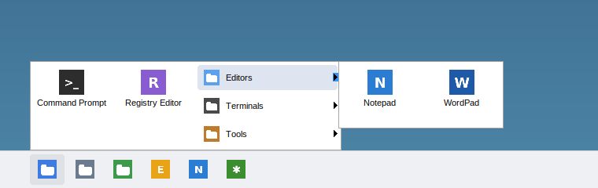

# FlexTaskbar

A portable application launcher for Windows 10 (version 1703 or later) and
Windows 11, for people with a lot of apps installed. You file apps into
categories nested as deeply as you like. Your categories and pinned apps then
sit as a strip of icons docked against the Windows taskbar. Rest the pointer on
a category and its apps pop up as a row of tiles, with subcategories cascading
on hover. The
same categories are also available from the tray icon, a hotkey menu, and a
type-to-search window.

FlexTaskbar does **not** replace or change the Windows taskbar. The strip sits
next to it (just above, or below a top taskbar), and can be turned off.

- Written in Rust against the native Win32 API. There's no .NET runtime, web
  engine or UI framework to install.
- One `FlexTaskbar.exe` of about 2 MB, with no installer. Settings are kept next
  to the exe.
- Restarts itself after a crash or hang.
- Fully local: no telemetry, no network access of any kind.

> **Status — please read.** This is a complete rewrite of the earlier .NET 8 / WPF
> version, which is still in the git history. It builds for Windows, and its
> core logic has unit tests. The UI was exercised under Wine (see
> [What has been tested](#what-has-been-tested)), but **it has not yet been run on
> a real Windows machine**. Treat it as a first release candidate. If something
> misbehaves, `data\crash.log` next to the exe is the first place to look.

## Screenshots


**The icon strip**: the FlexTaskbar button, then root categories and pinned apps.


| Hover a category: apps as tiles | Subcategories cascade, also as tiles |
|---|---|
|  |  |
| **FlexTaskbar button / tray: the full menu** | |
|  | |
| **Search (empty box: recent apps first)** | **Custom app (a browser web app)** |
|  |  |


These were captured under Wine on Linux, using a demo setup: Wine's built-in
programs filed into example categories, with custom icons. On Windows you see
your own apps with their real icons, in Windows' own control styling.

## Features

**Nested categories.** Categories can contain subcategories to any depth, plus
apps. The same app can be filed in several categories. In the tray and hotkey
menu a category is a submenu listing its subcategories, then its apps. From the
strip, a category opens as app tiles (below).

**The icon strip** is a bar docked against the Windows taskbar on the primary
monitor:
- **Layout.** The FlexTaskbar button is on the left. Your root categories and
  pinned apps are centred, like the Windows 11 taskbar.
- **Categories open on hover.** Resting the pointer on a category for a moment
  opens its contents upward:
  - Apps appear as **tiles**, each a large icon with the name underneath, in a
    horizontal row. Long categories wrap into rows of 8.
  - The category's subcategories are listed in a column at the right end.
    Hovering one opens it the same way, at any depth. The column sits at the
    right edge so each cascade opens beside the popup, not over its tiles.
  - Arrow keys, Enter and Esc work as in any menu.
- **Slide between categories.** While a category is open, moving along the
  strip switches to the next one, like a menu bar.
- **Pinned apps** launch with a click. You can pin an app from the Manage
  window (*Pin to strip*), or drag `.exe`/`.lnk` files onto the strip.
- **Right-click** an icon to move it left or right, unpin it, or hide the strip.
- **Screen space.** By default the strip reserves its space like the taskbar
  does, so maximized windows stop above it. You can turn that off in the Manage
  window, and then the strip floats on top instead.
- **Full-screen apps.** It hides while a full-screen app (a game or a video) is
  in front.

**Four ways to launch:**

| How | What you get |
|---|---|
| The icon strip | Hover a category, click a pinned app; the FlexTaskbar button shows the full menu |
| Left- or right-click the tray icon | The full menu |
| **Ctrl+Alt+M** (changeable) | The category menu at the mouse pointer |
| **Ctrl+Alt+Space** (changeable) | The search window: type, use ↑/↓ to pick, Enter to launch, Esc to close |

Search matches the app name, its file name, and the names of the categories it
is filed under. So typing "dev" finds every app inside "Dev › Editors" too.
Initials work as well ("vsc" → Visual Studio Code). When the box is empty, it
lists recently used apps first, then everything else A–Z.

**All your apps, automatically.** The app list is the Windows Apps folder, the
same list as Start's "All apps". It includes desktop programs, Microsoft Store
apps, and web apps installed from Chrome or Edge. It's rescanned in the
background each time FlexTaskbar starts, and on demand. If the Apps folder can't
be read, FlexTaskbar falls back to scanning the Start Menu shortcut folders.

**Custom apps.** You can add any program, shortcut, file, URL, `shell:` path or
protocol (such as `ms-settings:`) as an app, with optional arguments, a start
folder and "Run as administrator". Browser web apps can also be added by hand,
for example target `chrome_proxy.exe` with arguments `--profile-directory=Default --app-id=…`.
To add apps quickly, drag `.exe` or `.lnk` files onto the Manage window.

**Custom icons** for any app or category, from PNG, ICO, SVG, JPG, BMP or GIF
files. A copy of the image is kept in the data folder, so moving or deleting the
original doesn't break the icon.

**Theme.** Menus and the search window follow the Windows light or dark app
theme.

**Import from the old FlexTaskbar.** In the Manage window, *Import old
settings…* reads `%APPDATA%\FlexTaskbar\categories.json` and
`applications.json` from the .NET version. It adds those categories and apps
next to your current ones. Each imported app keeps its exact launch command, and
custom icons are copied over.

### What changed from the .NET version

The docked bar is back as the icon strip, with the same idea as before:
category and app icons in a row, with category contents popping up from them
as horizontal app tiles.
It now sits beside the Windows taskbar instead of trying to replace it, so these
old taskbar features are gone on purpose:
- running-window buttons
- the tray-icon mirror
- the clock and status indicators

Everything about organising and launching apps carried over:
- categories, now nested to any depth
- pinned apps
- custom category and app icons
- custom and web apps
- search
- recents
- hotkeys
- reserving screen space
- crash recovery

Your old categories can be imported (see above).

## Getting started

1. Put `FlexTaskbar.exe` in any folder you can write to, for example
   `D:\Tools\FlexTaskbar\` or a USB stick, and run it. The exe isn't code-signed,
   so Windows SmartScreen may ask you to confirm the first time.
2. On first run the **Manage categories** window opens:
   - **Categories** (left): use *New* / *New sub* to create categories, then
     type the name. *Rename*, *Delete*, ▲/▼ (reorder), *← Out* / *In →*
     (change nesting) and *Icon…* work on the selected category.
   - **All apps** (right): select one or more apps (Ctrl+click selects
     several) and click *← Add to category*.
   - **Apps in this category** (middle): reorder or remove the apps in the
     selected category.
   - To put an app straight on the strip, select it under **All apps** and
     click *Pin to strip*.
3. Close the window. Your root categories now appear on the strip, and
   FlexTaskbar keeps running in the tray. To open the window again, use
   *Manage categories…* from the FlexTaskbar button or the tray menu, or just
   run the exe again.

## Portable data

Everything FlexTaskbar keeps is stored in a `data` folder next to the exe:

```
FlexTaskbar.exe
data\
  config.json           categories, custom apps, icon choices, recents, settings
  config.json.bak       the previous good version (automatic)
  apps-cache.json       last app scan, for instant startup (safe to delete)
  icons\                copies of the custom icons you picked
  crash.log             restarts and problems, newest last
```

To move or back up your setup, copy the folder. To remove FlexTaskbar, turn off
*Start with Windows* (if you turned it on) and then delete the folder.

If the exe's folder isn't writable (for example under `C:\Program Files`),
FlexTaskbar uses `%LOCALAPPDATA%\FlexTaskbar\` instead. The Manage window's
status line tells you which one is in use.

*Start with Windows* is the one exception to "everything in the folder". It adds
a per-user `HKCU\Software\Microsoft\Windows\CurrentVersion\Run` entry pointing at
the exe. If you move the folder, the checkbox shows as off again; re-tick it to
point the entry at the new location.

The strip's reserved screen space is not stored anywhere. Windows gives it back
as soon as FlexTaskbar exits or the strip is turned off.

## Crash and hang recovery

Running `FlexTaskbar.exe` starts a tiny supervisor process with no window. The
supervisor starts the actual launcher as a second process and watches it:

- If the launcher exits for any reason other than you choosing *Exit*, the
  supervisor logs it to `crash.log` and starts it again within a few seconds.
  A tray notification then tells you it was restarted.
- If the launcher stops responding for about a minute, it is ended and
  restarted the same way.
- If it crashes 5 times within 2 minutes, the supervisor stops trying and shows
  a message, so a broken setup can't loop forever.
- Nothing is restarted while Windows is logging off or shutting down.

Settings are saved after every change. Each save is atomic: it writes a temporary
file and then swaps it in, keeping the previous version as `config.json.bak`.
If `config.json` is ever damaged, FlexTaskbar keeps the damaged file as
`config.json.corrupt-<time>`, loads the backup, and tells you.

## Command-line options

Run these while FlexTaskbar is running to control the running copy. They're
handy for binding to other tools such as AutoHotkey or a mouse utility.

| Option | Effect |
|---|---|
| *(none)* | Start, or open the Manage window if already running |
| `--search` | Open the search window |
| `--menu` | Show the category menu at the mouse pointer |
| `--manage` | Open the Manage window (`--settings` does the same) |
| `--exit` | Close FlexTaskbar cleanly (it is not restarted) |
| `--reset` | Start with default settings. The current `config.json` is kept as `config.json.reset-<time>`. Only works when FlexTaskbar isn't already running. |
| `--no-supervisor` | Run without crash/hang recovery (for debugging) |

## Settings not shown in the window

These can be edited in `data\config.json` while FlexTaskbar is not running:

| Key under `settings` | Default | Meaning |
|---|---|---|
| `max_recents` | `10` | How many recently used apps are remembered |
| `show_recents_in_menu` | `true` | Show the *Recent* submenu |
| `group_all_apps_above` | `40` | Above this many apps, *All apps* is split into A–Z submenus |
| `strip_height` | `48` | Strip height in DIPs (48 matches the Windows 11 taskbar; 24–96) |
| `hover_delay_ms` | `250` | How long the pointer rests on a category before it opens |
| `tile_menus` | `true` | Strip category popups show apps as tiles; `false` gives a plain list |
| `tile_columns` | `8` | Tiles per row before a category popup wraps |

Showing the strip and reserving its space are checkboxes in the Manage window.

The hotkeys are set in the Manage window. To turn a hotkey off, clear its box
with Backspace and click *Apply hotkeys*.

## Performance

The launcher is built to cost almost nothing while idle:
- It waits on Windows messages and never polls. The strip's only timer is the
  short hover delay, started when the pointer enters a category icon. The
  supervisor wakes every 5 seconds to check that the launcher is still
  responding.
- The app scan and icon loading happen on background threads. Icons come from
  Windows' own icon cache and are kept in memory after the first load.
- Menus are native Windows popup menus. The strip paints a handful of icons
  with GDI, and it uses no animation, composition or GPU.
- The search list is virtual, so it only creates rows for what's on screen.
- The Manage window is fully destroyed when you close it.
- The release build uses LTO and is stripped.

Memory and CPU use have **not yet been measured on Windows**, so no numbers are
claimed here.

## What has been tested

**Automated, on every build.** CI builds the release exe on a Windows runner
(MSVC) and runs `cargo fmt --check`, `clippy -D warnings` and the tests there.
The 29 unit tests cover:
- the config format: round trips, recovering a corrupt file from the backup,
  never overwriting a good backup with a bad file, tolerating unknown and
  missing fields
- category tree operations at any depth: add, remove, reorder, indent/outdent,
  app membership
- search ranking
- strip layout (centring, overflow, hit testing), tile grid ordering, and
  pinning
- the old-settings importer, including cycles in old data and bad JSON

**Manually, under Wine 9 on Linux** (not real Windows):
- the icon strip:
  - hover-to-open categories as app tiles, with subcategories cascading from
    the folder column
  - launching from a tile
  - sliding between open categories
  - launching a pinned app
  - the FlexTaskbar button
  - the right-click menu (move, unpin)
  - *Pin to strip*
  - showing and hiding it
  - coming back after a crash
- first-run Manage window
- creating three levels of nested categories, including renaming them
- the custom-app dialog
- the nested tray menu, launching from it, and recents
- the search window: filtering, category-path matches, no-match state
- SVG and PNG custom icons on categories and apps
- importing old .NET settings
- Start Menu fallback scan, which skips "Uninstall…" entries
- restore after a corrupt `config.json`
- `--menu`, `--search`, `--manage` and `--exit` reaching the running copy
- restart after the launcher process was killed, and the crash-loop stop after
  5 kills
- the screenshots and the GIF above come from a scripted run of this flow

**Not yet verified**, because Wine can't show it, so expect rough edges here:
- the Apps folder scan
- shell app icons
- the global hotkeys
- dark mode, including the colours of the tile popups
- high-DPI scaling
- *Start with Windows*
- hang detection
- tray behaviour with the real Windows taskbar
- dragging files onto the strip or the Manage window
- the strip next to the real Windows taskbar: reserving screen space,
  hiding for full-screen apps, and a taskbar at the top of the screen. Wine
  has no Windows taskbar, so there the strip sits at the bottom of the screen.

## Building

You need Rust (stable) and Windows' MSVC build tools (the Visual Studio Build
Tools with the "Desktop development with C++" workload), then:

```powershell
cargo build --release
# -> target\release\FlexTaskbar.exe
cargo test
```

To cross-compile from Linux, install `mingw-w64`, then run
`rustup target add x86_64-pc-windows-gnu` and
`cargo build --release --target x86_64-pc-windows-gnu`. On Linux,
`cargo test` runs the platform-independent tests.

CI (`.github/workflows/build.yml`) builds on Windows, runs the checks and tests,
and uploads `FlexTaskbar-portable.zip` as a build artifact.

### Source layout

```
src/main.rs          entry point
src/config.rs        config model + atomic save / backup recovery   (tested)
src/tree.rs          nested category operations                       (tested)
src/search.rs        search ranking                                   (tested)
src/striplayout.rs   icon strip layout and hit testing                (tested)
src/migrate.rs       import from the .NET version                     (tested)
src/win/mod.rs       process model, single instance, command forwarding
src/win/supervisor.rs  crash/hang restart
src/win/app.rs       state, tray icon, hotkeys, message loop, launching, icon cache
src/win/menu.rs      nested popup menus (full menu, one category)
src/win/strip.rs     the icon strip: AppBar docking, painting, hover menus
src/win/tiles.rs     owner-drawn app tiles in category popups
src/win/searchwin.rs search window
src/win/manager.rs   Manage categories window
src/win/appdialog.rs custom-app dialog
src/win/catalog.rs   Apps folder / Start Menu scan
src/win/icons.rs     shell, WIC and SVG icon loading
src/win/launch.rs    ShellExecuteEx launching
src/win/autostart.rs Run-key toggle
src/win/paths.rs     portable data folder
src/win/theme.rs     light/dark support
src/win/ui.rs        small Win32 helpers
assets/              icon, manifest, resource script
```

## Privacy

Everything stays on your machine. There are no network requests, telemetry,
analytics or cloud services.

## License

TBD.
