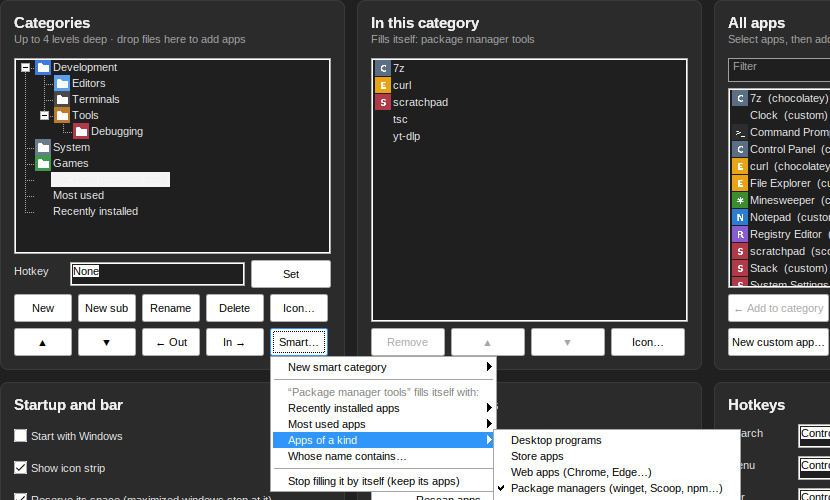
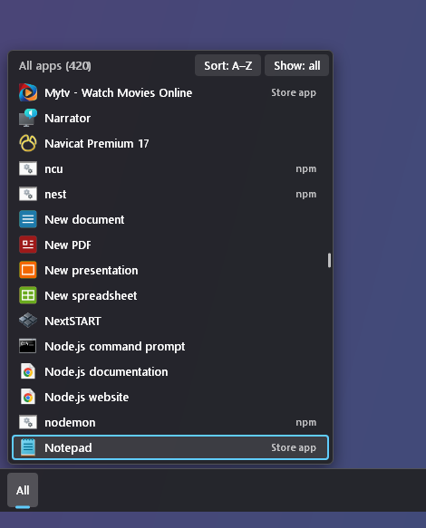
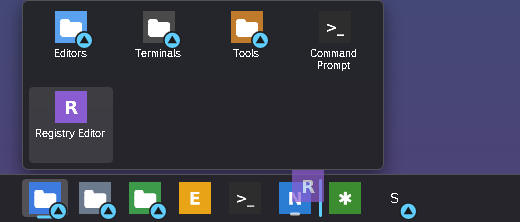
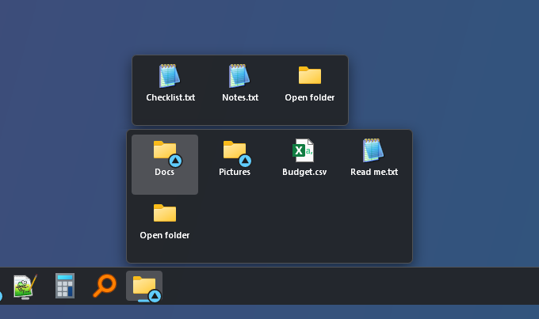
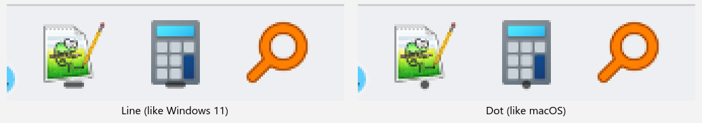
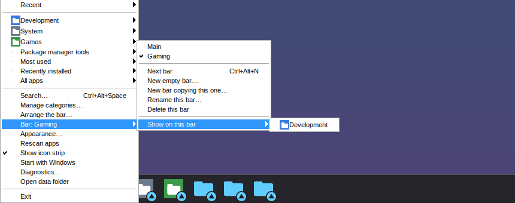
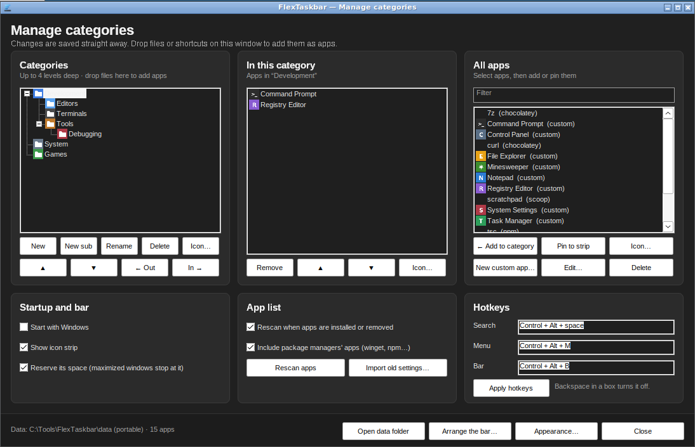

# FlexTaskbar

A portable application launcher for Windows 10 (version 1703 or later) and
Windows 11, for people with a lot of apps installed. You file apps into
categories nested several levels deep (as many as your screen can show,
up to 7). Your categories and pinned apps then
sit in a bar docked against an edge of the screen (by default next to the
Windows taskbar; drag it to the bottom, top, left or right), in the look of the
original FlexTaskbar. Rest the pointer on a category and a flyout pops up with
its subcategories and apps as tiles. Rest on a subcategory and its own flyout
opens beyond it, the same way, as many levels deep as your categories go.
Flyouts always open away from the bar's edge, towards the middle of the screen.
Theme (dark, light or Windows default), colours, transparency, border and
rounded corners are all adjustable. The same categories
are also available from the tray icon, a hotkey menu, and a type-to-search
window.

FlexTaskbar does **not** replace or change the Windows taskbar. By default the
bar sits next to it, on the same edge, and it can be turned off.

- Written in Rust against the native Win32 API. There's no .NET runtime, web
  engine or UI framework to install.
- One `FlexTaskbar.exe` of about 2 MB, with no installer. Settings are kept next
  to the exe.
- Restarts itself after a crash or hang.
- Fully local: no telemetry, no network access of any kind.

> **Status — please read.** This is a complete rewrite of the earlier .NET 8 / WPF
> version, which is still in the git history. It builds for Windows, and its
> core logic has unit tests. The UI was exercised under Wine (see
> [What has been tested](#what-has-been-tested)), but **it has not yet been run on
> a real Windows machine**. Treat it as a first release candidate. If something
> misbehaves, `data\crash.log` next to the exe is the first place to look.

## Screenshots


**The bar**: *All* on the left, root categories (marked with an arrow badge) and pinned apps in the
centre, *Link* and settings (⚙) on the right. These are the defaults, which
match the original .NET version.


**Any edge**: drag the bar by an empty spot to the left, right, top or bottom.
Its flyouts open towards the middle of the screen, as horizontal strips from a
top or bottom bar and vertical strips from a side bar.


| Left edge: vertical flyouts open to the right | Right edge: vertical flyouts open to the left |
|---|---|
|  |  |
| **Top edge: horizontal flyouts open downwards** | |
|  | |

| Hover a category: subcategories and apps as tiles | Hover a subcategory: its flyout floats above |
|---|---|
|  |  |
| **All: every app, labelled Store app, Chrome or Edge web app** | **Light theme, rounded floating dock** |
|  |  |
| **Drag an icon to rearrange the bar** | **Arrange the bar (from Manage or right-click)** |
|  |  |
| **Appearance window** | **Flyouts with their own corners and border** |
|  |  |
| **Right-click: the full menu** | **All, sorted by category with the System category hidden** |
|  |  |
| **Search** | **Custom app dialog** |
|  |  |


These were captured under Wine on Linux, using a demo setup: Wine's built-in
programs filed into example categories, with custom icons. On Windows you see
your own apps with their real icons, in Windows' own control styling. Most were
taken without a compositor, where translucent parts of the bar blend against
black; on Windows they show the desktop behind them. The flyout shadows were
captured with a compositor (xcompmgr), as they look on Windows.

## Features

**Nested categories.** Categories can contain subcategories, plus
apps. The same app can be filed in several categories. In the tray and hotkey
menu a category is a submenu listing its subcategories, then its apps. From the
bar, a category opens as a flyout (below).

**How deep.** Every level of subcategories opens another flyout, so the nesting
depth follows the screen: as many levels as fit their flyouts, between 3 and 7.
A level counts as two rows of tiles above or below a top or bottom bar, or one
column beside a side bar. For example, a 1920×1080 screen with the bar at the
bottom allows 5 levels (a root category plus 4 levels of subcategories),
2560×1440 allows 7, and a bar on the left or right of a wide screen allows 7.
The Manage window shows the limit above the category tree and won't add or
indent a category past it. Categories already deeper (from an import, or after
switching to a smaller screen) keep working; their flyouts just overlap.

**Smart categories** fill themselves. Make one with *Smart…* under the
category tree in the Manage window, then *New smart category*:
- **Recently installed:** apps that turned up in the last 14 days, newest
  first. You can pick 7, 14, 30 or 90 days.
- **Most used:** the 10 apps you launch (or switch to) most often. You can
  pick 5, 10, 15 or 20.
- **Package manager tools, Web apps, Store apps,** or **apps whose name
  contains** some words (the name or the file, ignoring case).

With a smart category selected, *Smart…* changes what fills it. *Apps of a
kind* ticks one or more kinds. *Whose name contains…* sets the words; it
combines with the kinds, and an empty answer clears them. *Stop filling it
by itself* turns it into an ordinary category that keeps the apps it has.

How it behaves:
- The list updates when the app list changes (a rescan, a custom app added
  or removed) and after every launch. A smart category holds at most 48 apps.
- It can't be filled by hand: adding, removing and reordering its apps are
  turned off, and nothing can be dropped on it. So nothing you filed
  yourself ever moves. A smart category has no subcategories, but it can
  sit inside an ordinary one, and it can have an icon and a hotkey like
  any category.
- New apps are noted the first time the list contains them. Apps already
  there when FlexTaskbar first looked don't count as recently installed.
  Neither does a batch of more than 10 apps appearing at once (such as
  turning on package managers' apps), since that isn't new installs.



**The bar** is docked against an edge of the primary monitor, laid out like the
original FlexTaskbar:
- **Any edge.** By default it sits next to the Windows taskbar, on the same
  edge. To move it, press on an empty spot of the bar and drag it towards
  another edge of the screen: it docks there as soon as the pointer is nearest
  that edge, like the Windows taskbar. Or pick *Position* in the Appearance
  window (*Next to the Windows taskbar*, *Bottom*, *Top*, *Left*, *Right*).
  On the left or right edge the bar stands upright: *All* at the top, icons
  down the middle, *Link* and ⚙ at the bottom.
- **Start (left, or top on a side bar): *All*.** Click it for a list of every app (scroll with the wheel;
  right-click an app to pin or unpin it).
  - **Sort:** the *Sort* button at the top orders the list by name (A–Z or
    Z–A), by type (desktop programs, Store apps, web apps, package managers'
    apps, custom apps), by category (a heading per root category, an app filed
    under two shows under both, then *Not in a category*), or with recently
    used apps first.
  - **Show:** the *Show* button ticks app types and root categories on and
    off. Hiding a category hides the apps that are only in that category;
    *Not in a category* covers the rest, and *Show everything* turns it all
    back on. While anything is hidden the title reads e.g. "12 of 15 apps".
  - Both choices are saved (`settings.all_apps`).
  - **Your own picture instead of the word "All".** In the Appearance window,
    *All button picture* → *Choose…* takes any PNG, JPEG, BMP, GIF, ICO or
    SVG file. A copy is kept in the data folder (`data\icons\`), so it
    travels with the portable settings and the original can be moved or
    deleted. *Use text* goes back to the word (and deletes the copy), as does
    *Reset to defaults*.

    
- **Centre: root categories and pinned apps.** A category carries a
  bright badge in the accent colour on its icon's corner, with an arrow pointing
  where its flyout opens (up from a bottom bar, down from a top bar, sideways
  from a side bar). That mark can be changed in the Appearance window
  (*Category indicator*): a badge with an arrow, a plain arrow, a dot, a folded
  corner, an underline, none at all, or **your own picture**. Pick *Your own
  picture* (or *Choose…*) and select any PNG, JPEG, BMP, GIF, ICO or SVG file;
  a copy is kept in the data folder (`data\icons\`), so the original can be
  moved or deleted. *Remove* deletes the copy. The mark's size is adjustable
  too.

  
- **End (right, or bottom on a side bar): *Link* and ⚙.** *Link* adds a website, program, file or `shell:`
  path and pins it to the bar. ⚙ opens the Manage window.
- **Category flyouts.** Resting the pointer on a category opens a flyout beside
  it, on the screen side: above a bottom bar, below a top bar, to the right of
  a left bar and to the left of a right bar:
  - its **subcategories and apps as tiles**, each a large icon with the name
    underneath. Subcategories come first and carry the same arrow badge, like
    categories on the bar. The flyout runs the same way as the bar: on a top
    or bottom bar it is a **horizontal strip** (4 tiles per row by default,
    wrapping into more rows); on a left or right bar it is a **vertical
    strip**, one column top to bottom, wrapping into another column only if
    it would be taller than the screen;
  - resting the pointer on a subcategory opens **its flyout beyond this one**
    (further from the bar, lined up with the tile), and so on down the levels.
    Moving to another subcategory switches it; resting on an app tile closes
    it. Tiles fill from the bar's side outwards: below a top bar the **app
    icons fill the top rows first**, right under the bar, and the
    subcategories follow below them, nearest where their own flyouts open;
  - *No apps in this category* when it's empty. Flyouts only launch apps;
    categories are managed in the Manage window (⚙ on the bar, or
    right-click a category and pick *Manage categories…*).
  - The flyouts close shortly after the pointer leaves all of them and the
    bar button.
  - **Keyboard control.** Click *All*, or press the bar hotkey
    (**Ctrl+Alt+B**, changeable on the Manage window's *Hotkeys* card, or
    run `FlexTaskbar.exe --bar`), and the flyouts take the keyboard:
    - **arrow keys** move between tiles and rows (a ring in the accent
      colour shows where you are), scrolling the *All* list at its ends;
      **Page Up/Down**, **Home** and **End** scroll it further;
    - **typing** jumps to the first app or tile whose name, or a word in
      it, starts with what you typed (pause a second to start again;
      typing the same letter again moves to the next one). In *All* it
      searches the whole list, not just what's on screen;
    - **Enter** (or **Space**) launches, or opens a subcategory and moves
      into it; **Esc** or **Backspace** goes back a level, and closes from
      the first;
    - **Tab** / **Shift+Tab** move to the next or previous button on the
      bar with a flyout (*All*, then each category).

    Once a key has been used the flyouts stay open while the pointer is
    elsewhere, and close when you switch to another window; until then
    they close when the pointer leaves, as before.

    
  - **Opening animation.** Every flyout (category, subcategory and *All*)
    can animate as it opens. Pick one in the Appearance window
    (*Opening animation*), with its length (60–600 ms, 180 by default):
    - *Fade* (the default): fades in;
    - *Slide*: fades in, moving out a little from the bar;
    - *Scale*: grows out of the button it opens from;
    - *Drawer*: pulled out of the bar, the far end first;
    - *Genie*: stretched out of its button like the macOS genie effect, the
      far end widening first and the end at the bar staying as narrow as the
      button until last;
    - *Off*: shown at once.

    **Closing** plays the same animation in reverse (a little quicker),
    back into the button: a Genie flyout is pulled back in, a Drawer one
    slides back into the bar. Turn it off with *When closing* → *Close at
    once*. A closing flyout no longer takes the pointer, so the next one
    opens straight away; moving along the bar to another category swaps
    them at once.

    Each frame is made from the finished flyout, so it is drawn only once;
    the frames run only while it opens, and the flyout can be used straight
    away.

    
  - **Shadow.** Every flyout (category, subcategory and *All*) casts a
    shadow on the desktop. Pick its style in the Appearance window
    (*Shadow*), and how strong it is (*Shadow strength*, 10–100 %):
    - *Soft* (the default): soft and a little below, like Windows 11's menus;
    - *Floating*: larger and further below, lifted off the desktop;
    - *Even all round*: the same on every side;
    - *Sharp*: a crisp shadow offset to the lower right;
    - *Glow*: a halo in the accent colour;
    - *Off*.

    The shadow stops at the bar's edge so it never dims the bar's icons, and
    the pointer passes through it: resting on a shadow is the same as
    leaving the flyout, and clicks there reach what's underneath. It is
    drawn once per flyout size and look, and reused while the flyout is
    redrawn on hover or scrolled, so it adds nothing to hovering.

    
- **Hover animations**, in the spirit of the macOS Dock, on every icon of the
  bar (categories and pinned apps). Pick one in the Appearance window, or turn
  them off:
  - *Magnify* (the default): the icon under the pointer grows, its neighbours a
    little, following the pointer smoothly;
  - *Lift*: the icon rises towards the screen;
  - *Bounce*: the icon hops twice;
  - *Pulse*: the icon briefly grows and settles;
  - *Off*.

  The icons grow and move within the bar's thickness (a thicker bar leaves more
  room). Frames are drawn only while something moves, about 60 a second, and
  stop as soon as it settles.

  
- **Slide between categories.** While a flyout is open, moving along the bar
  switches to the next category straight away.
- **Pinned apps** launch with a click. You can pin an app from the Manage
  window (*Pin to strip*), from the *All* list, with *Link*, by dragging
  `.exe`/`.lnk` files onto the bar, or by dragging it out of a flyout.
- **Drag apps out of a flyout or the *All* list.** Press on a tile or a row
  and drag: a see-through copy of its icon follows the pointer.
  - Let go **between two buttons on the bar** (a line shows where) and the
    app is pinned there. If it is pinned already, it moves there.
  - Let go **on a category's button** (it gets a ring) and the app is filed
    in that category. The same works on a **subcategory's tile** in an open
    flyout.
  - The app stays wherever else it was filed; an app can be in several
    categories.
  - Letting go anywhere else, or pressing Esc, cancels.

  
- **Folders on the bar.** Drag a folder onto the bar (or use *Link* with a
  folder as the target) and it opens like a category: rest on it, or
  click it, and a flyout lists what is in it, like the Dock's stacks.
  Subfolders come first and open their own flyout beyond (as deep as
  categories may go); files open as they would in Explorer; *Open folder*
  at the end opens it in Explorer. Hidden and system files are left out,
  and at most 48 things are shown (*Open folder* says how many more there
  are). The folder is read when its flyout opens, so it is always up to
  date; nothing watches it in between. Folders work with the keyboard and
  Tab like categories.

  
- **Running apps.** An app with a window open gets a mark: a short line under
  its icon on the bar (*Line*, like Windows 11) or a dot (*Dot*, like macOS),
  under its tile in a flyout, and on the left of its row in *All*. Change or
  turn it off with *Running apps* on the Appearance window's *Bar* card.
  Clicking a running app **switches to it** instead of starting another
  copy: it comes to the front (restored if minimised); if it is already in
  front, its only window is minimised, or with several the next one comes
  forward, like the Windows taskbar. **Shift+click** starts another copy.
  Turn switching off with *Clicking a running app switches to it* on the
  Manage window's *Startup and bar* card.

  Windows are matched to apps by their AppUserModelID (Store apps, Chrome and
  Edge web apps) or by the program they run, which the app list reads from
  each Start Menu shortcut. A web app's window counts only for that web app,
  not for the browser. Windows tells FlexTaskbar when windows open and close
  (it registers for the same notifications the taskbar gets), so the marks
  follow without any polling.

  
- **Rearrange by dragging.** Press on a category or app icon and drag it along
  the bar; the others make room, and it stays where you let go. Categories
  and apps can be mixed in any order. Let go away from the bar to cancel.
- **Arrange the bar** (in the Manage window, the menu, or right-click the bar): the same
  order as a list, left to right. Drag a row, or use *Move to start*, *Move
  left*, *Move right*, *Move to end* and *Unpin*. Changes show on the bar
  straight away. (This order is the bar's own; the menus keep the order of
  the category tree.)
- **Right-click** an icon to move it left or right, unpin it (an app) or hide
  it from this bar (a category), arrange the bar, manage categories or change
  the appearance; right-click anywhere else for the full menu.
- **Several bars** ("Work", "Gaming"…). Each has its own pinned apps and
  order, and can leave out some top-level categories. Use the *Bar* submenu
  in the full menu (tray icon, or right-click an empty part of the bar):
  - Pick a bar to switch to it (the one in use is ticked). **Ctrl+Alt+N**
    (changeable: *Next bar* on the Manage window's *Hotkeys* card) goes to
    the next one.
  - *New empty bar…* starts with just the categories. *New bar copying
    this one…* starts as a copy of the bar in use.
  - *Rename this bar…* and *Delete this bar*. The last bar can't be
    deleted. Deleting one only forgets its pins and order; the apps and
    categories stay.
  - To leave a category off a bar, right-click it there and choose *Hide
    from this bar*. *Show on this bar* in the *Bar* submenu puts it back.
    A hidden category stays in the menus, in search and on the other bars.

  Pinning, unpinning, dragging and *Arrange the bar* all change the bar in
  use. The bar starts as *Main*.

  
- **Screen space.** By default the bar reserves its space like the taskbar
  does, so maximized windows stop above it. You can turn that off in the Manage
  window, and then the bar floats on top instead.
- **Full-screen apps.** It hides while a full-screen app (a game or a video) is
  in front.
- **Auto-hide.** *Auto-hide* on the Appearance window's *Bar* card hides the
  bar when the pointer leaves it: *Slide away* slides it past the screen
  edge, *Fade away* fades it out. A 2-pixel line stays at the edge; touch
  it with the pointer and the bar comes back. *Hide after* sets the delay
  (0–3000 ms, 600 by default). The bar stays while one of its flyouts or
  its menu is open or an icon is being dragged, and comes back by itself
  for the bar hotkey. An auto-hiding bar doesn't reserve screen space and
  docks against the screen's own edge, so when shown it lies over the
  Windows taskbar rather than above it. Each frame of the slide or fade
  moves or fades the last drawing of the bar; nothing is redrawn.

**Settings windows.** The Manage, Appearance, *Arrange the bar* and custom-app
windows share one look, in the style of Windows 11 Settings: a page title
with a line on what the page does, the settings grouped on white cards with
rounded corners and a title each (*Categories*, *All apps*, *Startup and
bar*, *Hotkeys*, *General*, *Category flyouts*…), on a soft grey page, and a
command bar along the bottom for the window's main buttons. The cards are
drawn anti-aliased, only when Windows asks for the window to be painted.
They follow the *Theme* setting like the bar does: **dark** (the default)
or light, switching straight away when the theme changes, including the
title bars, lists, text boxes and drop-downs.



**Appearance.** Right-click the bar (or use the menu) and pick *Appearance…*.
Every change shows on the bar straight away:

| Setting | Choices | Default |
|---|---|---|
| **General** | | |
| Theme | Windows default, Dark, Light | Dark (the original look) |
| Accent colour | Any colour (marks the open button) | Light blue `#60CDFF` |
| Background colour | Any colour; the text turns dark or light to stay readable | Theme's colour |
| Background opacity | 10–100 % (icons and text stay solid) | 87 % |
| Icon size | 16–48 | 32 |
| **Category indicator** | | |
| Style | Badge with arrow, Arrow, Dot, Folded corner, Underline, Your own picture, None | Badge with arrow |
| Picture | Any PNG, JPEG, BMP, GIF, ICO or SVG; copied into `data\icons\` | none |
| Size | 25–80 % of the icon | 48 % |
| **Bar** | | |
| Position | Next to the Windows taskbar, Bottom, Top, Left, Right (or drag the bar) | Next to the Windows taskbar |
| Bar width | Full screen width, or fitted to its icons (a floating dock) | Full |
| Auto-hide | Never, Slide away, Fade away | Never |
| Hide after | 0–3000 ms | 600 ms |
| Border colour | Any colour | A faint line in the text colour |
| Border width | 0–6 | 1 |
| Corner radius | 0–24 (0 = square, like the taskbar) | 0 |
| Gap from screen edge | 0–24 | 0 (docked flush) |
| Bar thickness | 32–96 (its height, or its width on a side edge) | 48 |
| Hover animation | Off, Magnify (like the macOS Dock), Lift, Bounce, Pulse | Magnify |
| Running apps | No mark, Dot (like macOS), Line (like Windows 11) | Line |
| All button picture | Any PNG, JPEG, BMP, GIF, ICO or SVG instead of the word; copied into `data\icons\`; *Use text* goes back | The word "All" |
| **Category flyouts** | | |
| App tiles per row | 1–12 (top and bottom bars; on a side bar a flyout is one column) | 4 |
| Border colour | Any colour | Same as the bar |
| Border width | 0–6 | 1 |
| Corner radius | 0–24 | 6 |
| Opening animation | Off, Fade, Slide, Scale, Drawer, Genie (like macOS) | Fade |
| Animation length | 60–600 ms | 180 ms |
| When closing | Play it in reverse, Close at once | Play it in reverse |
| Shadow | Off, Soft (like Windows 11), Floating, Even all round, Sharp, Glow (accent colour) | Soft |
| Shadow strength | 10–100 % | 100 % |

The theme also applies to the menus, the search window and the settings
windows. *Reset to defaults*
brings back the original look.

**Saved looks.** *Saved looks…* in the Appearance window keeps whole looks
to switch between:
- *Save this look…* stores everything on the page under a name (saving
  under a name that exists asks before replacing it);
- *Use "…"* switches to a saved look in one click; *Delete* removes one;
- *Export this look…* writes it, with its pictures (indicator and *All*
  button), to a `.flexlook` file to share or keep; *Import a look…* adds
  one and switches to it. Import is checked like a backup (see *Portable
  data*): only `look.json` and plain picture names, sizes and checksums.
  A picture that clashes with a different one of the same name is kept
  under a new name, and an imported look whose name is taken gets
  "(2)" added.

Pictures a saved look shows are kept even when the current look stops
using them.

**Five ways to launch:**

| How | What you get |
|---|---|
| The bar | Hover a category, click a pinned app, or click *All*; right-click for the full menu |
| Left- or right-click the tray icon | The full menu |
| **Ctrl+Alt+M** (changeable) | The category menu at the mouse pointer |
| **Ctrl+Alt+Space** (changeable) | The search window: type, use ↑/↓ to pick, Enter to launch, Esc to close |
| **Ctrl+Alt+B** (changeable) | The bar's *All* list, ready for the keyboard (see below) |
| **Ctrl+Alt+N** (changeable) | The next bar, if you have made several (see *Several bars*) |
| **A category's own hotkey** (none until you set one) | That category's flyout, ready for the keyboard; for a subcategory (no button on the bar), its menu at the pointer |

Search matches the app name, its file name, and the names of the categories it
is filed under. So typing "dev" finds every app inside "Dev › Editors" too.
Initials work as well ("vsc" → Visual Studio Code). When the box is empty, it
lists recently used apps first, then everything else A–Z.

**All your apps, automatically.** The app list is the Windows shell Apps folder
(`shell:AppsFolder`), the same list as Start's "All apps". So *All*, search and
the Manage window include:
- desktop programs;
- **Microsoft Store and other modern Windows 10/11 apps** (packaged apps, by
  their AppUserModelID, such as Calculator or Windows Terminal);
- **web apps installed from Google Chrome** (*Install app* / *Create shortcut*)
  and **from Microsoft Edge** (*Install this site as an app*), and those of
  other Chromium browsers.

Each app is labelled by kind: *Store app*, *Chrome web app*, *Edge web app*,
*Web app* or *Custom* (desktop programs have no label). The label shows on the
right in the *All* list and the Manage window, and next to the category path in
search, so typing "web app" or "store" finds them. If the Apps folder can't be
read, FlexTaskbar falls back to scanning the Start Menu shortcut folders, where
Chrome's web apps (its *Chrome Apps* folder) are still recognised; Store apps
need the Apps folder.

**Apps from package managers.** Many package managers install programs without
a Start Menu entry. FlexTaskbar also lists the programs in their folders,
labelled by manager:

| Manager | Folder it looks in |
|---|---|
| winget (portable packages) | `%LOCALAPPDATA%\Microsoft\WinGet\Links`, `%ProgramFiles%\WinGet\Links` |
| Scoop | `%SCOOP%\shims` (default `~\scoop\shims`), and the global `%ProgramData%\scoop\shims` |
| Chocolatey | `%ChocolateyInstall%\bin` (default `%ProgramData%\chocolatey\bin`) |
| npm (global packages) | `%APPDATA%\npm` |
| pip (`--user` and per-user Pythons) | every `PythonXY\Scripts` under `%APPDATA%\Python` and `%LOCALAPPDATA%\Programs\Python` |
| pipx | `%PIPX_BIN_DIR%` (default `~\.local\bin`) |
| Cargo | `%CARGO_HOME%\bin` (default `~\.cargo\bin`) |
| .NET tools | `~\.dotnet\tools` |
| Go | `%GOBIN%`, or `%GOPATH%\bin` (default `~\go\bin`) |

The managers' own commands (`choco`, `scoop`, `npm`, `pip`, `cargo`…) are left
out, and a program that is already in the list under the same name (for
example a Scoop app that also has a Start Menu shortcut) isn't listed twice.
Command-line tools open in a console window that stays open, in your user
folder. Their path is handed to `cmd.exe` quoted so that characters a file
name may contain, such as `&`, can't start another command; a path cmd would
still expand (with `%` or `!` in it) is started directly instead. Apps that winget, Chocolatey or UniGetUI install with a normal
installer have a Start Menu entry, so they are in the Apps folder anyway.
Turn this off with *Include package managers' apps* in the Manage window (*App list* card).

**Automatic rescan.** The list is rescanned in the background when FlexTaskbar
starts, on demand (*Rescan apps*), and **by itself when apps are installed or
removed**. A background thread watches the Start Menu folders (where installers,
winget, Chocolatey, UniGetUI and Chrome/Edge web apps put their shortcuts),
`%LOCALAPPDATA%\Packages` (every Store app gets a folder there) and the package
managers' folders above. A few seconds after the last change, once the
installer has finished, the list is rescanned, so a new app or web app appears
in *All*, search and the Manage window without doing anything. Folders that
appear later (a package manager installed after FlexTaskbar started) are
picked up within a few minutes. Turn it off with *Rescan when apps are
installed or removed* on the Manage window's *App list* card.

**Custom apps.** You can add any program, shortcut, file, URL, `shell:` path or
protocol (such as `ms-settings:`) as an app, with optional arguments, a start
folder and "Run as administrator". Browser web apps can also be added by hand,
for example target `chrome_proxy.exe` with arguments `--profile-directory=Default --app-id=…`.
To add apps quickly, drag `.exe` or `.lnk` files onto the Manage window.

**Custom icons** for any app or category, from PNG, ICO, SVG, JPG, BMP or GIF
files. A copy of the image is kept in the data folder, so moving or deleting the
original doesn't break the icon.

**Import from the old FlexTaskbar.** In the Manage window, *Import old
settings…* reads `%APPDATA%\FlexTaskbar\categories.json` and
`applications.json` from the .NET version. It adds those categories and apps
next to your current ones. Each imported app keeps its exact launch command, and
custom icons are copied over.

### What changed from the .NET version

The docked bar is back in its original look: *All* on the left, category and
app icons in the centre, *Link* and ⚙ on the right, and category flyouts with
subcategory and app tiles. Managing categories moved out of the flyouts into
the Manage window. Subcategory flyouts open beyond the one they come from,
like the bar's own categories, and the bar can sit on any edge of the screen. Its colours, transparency,
border and corners are now adjustable.
It now sits beside the Windows taskbar instead of trying to replace it, so these
old taskbar features are gone on purpose:
- running-window buttons
- the tray-icon mirror
- the clock and status indicators

Everything about organising and launching apps carried over:
- categories, now nested up to 7 levels deep
- pinned apps
- custom category and app icons
- custom and web apps
- search
- recents
- hotkeys
- reserving screen space
- crash recovery

Your old categories can be imported (see above).

## Getting started

1. Put `FlexTaskbar.exe` in any folder you can write to, for example
   `D:\Tools\FlexTaskbar\` or a USB stick, and run it. The exe isn't code-signed,
   so Windows SmartScreen may ask you to confirm the first time.
2. On first run the **Manage categories** window opens:
   - **Categories** (left): use *New* / *New sub* to create categories, then
     type the name. *Rename*, *Delete*, ▲/▼ (reorder), *← Out* / *In →*
     (change nesting) and *Icon…* work on the selected category.
   - **All apps** (right): select one or more apps (Ctrl+click selects
     several) and click *← Add to category*.
   - **Apps in this category** (middle): reorder or remove the apps in the
     selected category.
   - To put an app straight on the strip, select it under **All apps** and
     click *Pin to strip*.
3. Close the window. Your root categories now appear on the strip, and
   FlexTaskbar keeps running in the tray. To open the window again, use
   ⚙ on the bar, *Manage categories…* in the right-click or tray menu, or just
   run the exe again.

## Portable data

Everything FlexTaskbar keeps is stored in a `data` folder next to the exe:

```
FlexTaskbar.exe
data\
  config.json           categories, custom apps, icon choices, recents, settings
  config.json.bak       the previous good version (automatic)
  apps-cache.json       last app scan, for instant startup (safe to delete)
  icons\                copies of the custom icons and indicator picture you picked
  crash.log             restarts and problems, newest last
```

To move or back up your setup, copy the folder, or use **Back up settings…**
on the Manage window's *Apps and settings* card. It saves one `.zip` with
`config.json` and the pictures in `icons\` (named like
`FlexTaskbar backup 2026-10-06.zip`). **Restore…** on any PC brings a backup
back:
- the whole file is checked first: every name (only `config.json` and plain
  file names under `icons/`, nothing that could reach outside the data
  folder), every size (8 MB a picture, 256 MB in all) and every checksum,
  and the settings must load, so a damaged or hand-made file changes
  nothing;
- the current settings are kept as `config.json.before-restore-<time>` in
  the data folder;
- FlexTaskbar then starts again by itself with the restored settings (the
  supervisor treats it as a requested restart, not a crash).

To remove FlexTaskbar, turn off *Start with Windows* (if you turned it on)
and then delete the folder.

If the exe's folder isn't writable (for example under `C:\Program Files`),
FlexTaskbar uses `%LOCALAPPDATA%\FlexTaskbar\` instead. The Manage window's
status line tells you which one is in use.

*Start with Windows* is the one exception to "everything in the folder". It adds
a per-user `HKCU\Software\Microsoft\Windows\CurrentVersion\Run` entry pointing at
the exe. If you move the folder, the checkbox shows as off again; re-tick it to
point the entry at the new location.

The strip's reserved screen space is not stored anywhere. Windows gives it back
as soon as FlexTaskbar exits or the strip is turned off.

## Crash and hang recovery

Running `FlexTaskbar.exe` starts a tiny supervisor process with no window. The
supervisor starts the actual launcher as a second process and watches it:

- If the launcher exits for any reason other than you choosing *Exit*, the
  supervisor logs it to `crash.log` and starts it again within a few seconds.
  A tray notification then tells you it was restarted.
- If the launcher stops responding for about a minute, it is ended and
  restarted the same way.
- If it crashes 5 times within 2 minutes, the supervisor stops trying and shows
  a message, so a broken setup can't loop forever.
- Nothing is restarted while Windows is logging off or shutting down.

Settings are saved after every change. Each save is atomic: it writes a temporary
file and then swaps it in, keeping the previous version as `config.json.bak`.
If `config.json` is ever damaged, FlexTaskbar keeps the damaged file as
`config.json.corrupt-<time>`, loads the backup, and tells you.

## Command-line options

Run these while FlexTaskbar is running to control the running copy. They're
handy for binding to other tools such as AutoHotkey or a mouse utility.

| Option | Effect |
|---|---|
| *(none)* | Start, or open the Manage window if already running |
| `--search` | Open the search window |
| `--menu` | Show the category menu at the mouse pointer |
| `--bar` | Open the bar's *All* list with the keyboard in it (like the bar hotkey) |
| `--manage` | Open the Manage window (`--settings` does the same) |
| `--diagnostics` | Show what FlexTaskbar is costing right now (see [Performance](#performance)) |
| `--exit` | Close FlexTaskbar cleanly (it is not restarted) |
| `--reset` | Start with default settings. The current `config.json` is kept as `config.json.reset-<time>`. Only works when FlexTaskbar isn't already running. |
| `--no-supervisor` | Run without crash/hang recovery (for debugging) |

## Settings not shown in the window

These can be edited in `data\config.json` while FlexTaskbar is not running:

| Key under `settings` | Default | Meaning |
|---|---|---|
| `max_recents` | `10` | How many recently used apps are remembered |
| `show_recents_in_menu` | `true` | Show the *Recent* submenu |
| `group_all_apps_above` | `40` | Above this many apps, *All apps* is split into A–Z submenus |
| `hover_delay_ms` | `100` | How long the pointer rests on a category before its flyout opens |

Showing the bar, reserving its space, rescanning automatically and including
package managers' apps are checkboxes in the Manage window (`show_strip`,
`reserve_space`, `auto_rescan` and `package_apps` under `settings`).
Everything about its look is in the Appearance window and is stored under
`settings.appearance`.

The hotkeys are set on the Manage window's *Hotkeys* card. To turn a hotkey
off, clear its box with Backspace and click *Apply hotkeys*.

Any category can have its own hotkey too: select it on the *Categories*
card, press the keys in the *Hotkey* box under the tree and click *Set*
(an empty box takes it away). A root category's hotkey opens its flyout
from the bar with the keyboard in it; a subcategory's opens its menu at
the pointer. Hotkeys need Ctrl, Alt or Shift (or an F key), and can't be
one FlexTaskbar already uses.

## Performance

The launcher is built to cost almost nothing while idle:
- It waits on Windows messages and never polls. The bar's only timers are the
  short hover delay, started when the pointer enters a category icon, the
  flyout's close delay, and the animations' frame timers, which run only
  while an icon is moving or a flyout is opening. Running apps are followed
  through Windows' window notifications: the windows are listed again once,
  150 ms after a burst of them (and when the pointer comes onto the bar),
  with each process's program and each window's AppUserModelID looked up
  once and kept while it's open. Drawing a running mark is a set lookup. The
  supervisor wakes every 5 seconds to check that the launcher is still
  responding.
- The app scan and icon loading happen on background threads. Icons come from
  Windows' own icon cache and are kept in memory after the first load.
- The bar and its flyouts are drawn in software (anti-aliased, with
  tiny-skia) only when something changes, and handed to Windows as
  per-pixel-alpha layered windows. Apart from the hover and opening
  animations nothing moves, and there's no GPU work. An opening animation's
  frames are stretched copies of the finished flyout, not redrawn.
  Menus are native Windows popup menus.
- The search list is virtual, so it only creates rows for what's on screen.
- A flyout's shadow is a blurred copy of its shape: a running-sum box blur
  (its cost doesn't grow with the blur's size), drawn once per flyout size
  and look and reused on every redraw.
- Pictures drawn on every frame of the bar (the *All* button's, the category
  indicator's) are loaded once per size and drawn from that cache without
  allocating or copying. Redrawing a flyout on hover hands its finished
  picture to Windows without copying it, and the *All* list lowercases each
  name once when sorting, not on every comparison.
- The Manage window is fully destroyed when you close it.
- The release build uses LTO and is stripped.

### Measuring it yourself

*Diagnostics…* in the tray (and right-click) menu, or
`FlexTaskbar.exe --diagnostics`, shows what the running launcher is costing:
memory (working set, private bytes and the peak), CPU time in all and on
average since it started, GDI and USER objects, handles, and how many times
the bar and the flyouts have been drawn, with the average and longest time.
Ctrl+C copies the message, and the same text is saved to
`data\diagnostics.txt`. Timing a redraw is two clock reads; nothing is
collected unless something is drawn, and nothing leaves the PC. The
supervisor process is separate and small, and isn't counted.

### Measured numbers

These were **measured under Wine 9 on Linux, not on Windows**, with 16 apps
in 7 categories, so take them as a rough guide; Windows' own numbers will
differ (Wine doesn't report private bytes, GDI/USER objects or handles, so
those lines are left out there):

| | Wine 9 (1280×800, 96 DPI) |
|---|---|
| Memory (working set) after start | 33.5 MB |
| Memory after opening flyouts 16 times | 33.9 MB (peak 39.1 MB) |
| CPU while idle | 20 ms over 64 s (about 0.03 % of one core) |
| Drawing the bar | 4.0 ms on average, 10.3 ms at most (836 draws, mostly hover animation frames) |
| Drawing a flyout | 7.9 ms on average, 25.2 ms at most (37 draws; animation frames aren't redrawn) |

Run *Diagnostics…* on your PC for real Windows numbers.

## What has been tested

**Automated, on every build.** CI builds the release exe on a Windows runner
(MSVC) and runs `cargo fmt --check`, `clippy -D warnings` and the tests there.
The 110 unit tests cover:
- the config format: round trips, recovering a corrupt file from the backup,
  never overwriting a good backup with a bad file, tolerating unknown and
  missing fields
- category tree operations at any depth: add, remove, reorder, indent/outdent,
  app membership, and the nesting limit (depth, subtree height, what may be
  added or indented)
- search ranking
- bar layout (the three zones, centring, overflow, the fitted dock, hit
  testing, where a dragged icon lands, where an app dragged in from a
  flyout lands: into a category or between two buttons), which edge a
  dragged bar docks to, where flyouts open for each edge (and staying on
  screen), how many levels fit on a screen, how flyout tiles run for each
  edge (rows for top and bottom bars, columns for side bars), pinning
  (including pinning at a place, or moving an app already pinned there),
  and the bar order (mixing categories and apps, moves, new and removed
  buttons)
- pinned folders: hidden and system files left out, folders first, then
  by name ignoring case, the cap with the number left over, and shortcut
  names shown without `.lnk`/`.url`
- smart categories: recently installed (newest first, the day limit, apps
  that were always there left out), most used (most launches first, ties
  by name, never-launched left out), kinds and words (in the name or the
  file, ignoring case), the 48-app cap, noting new apps (the first list
  and big batches as always there, apps gone forgotten so a reinstall is
  new again), filling them at any depth while leaving hand-made ones
  alone, the rule's format in `config.json`, and that a smart category
  can't be filled by hand or hold subcategories
- several bars: one bar to begin with (and older configs reading as one),
  new empty bars and copies (unique names), switching back and forth with
  each keeping its pins, order and hidden categories, the next bar
  wrapping round, renaming, deleting (never the last), hiding and showing
  a category, and a deleted app leaving every bar
- saved looks: unique names ("(2)", "(3)", blank names), saving replacing
  a look of the same name, the pictures a look shows, renaming one, and a
  picture counting as in use while any saved look shows it
- settings backups: the zip round trip (including an empty file), the CRC
  check value, only `config.json` and plain picture names accepted (no `..`,
  sub-folders, drives or other files), damaged, cut-short and non-zip files
  refused, a backup without settings or with them twice refused, the size
  limit, and look files (a backup isn't a look and a look isn't a backup)
- auto-hide: the slide and fade stepping towards their target and never
  past it, where the bar goes on each edge (leaving the 2-pixel line) and
  how opaque it is part-way, and Fade waiting off screen at full opacity so
  the line still catches the pointer
- running apps: which windows count (visible, not cloaked, titled, not a
  tool or owned window unless it asks to be shown), matching by
  AppUserModelID or program path (a web app not making its browser look
  open, an app started by bare name matching by file name, a full path only
  matching that program), and what a click does (start, switch, minimise
  the only window in front, cycle through several, Shift for another copy)
- keyboard control of the flyouts: which tile or row each arrow key moves
  to (in a grid, a short last row and a list under buttons), stopping at
  the edges, type-to-jump (name and word starts, the same letter moving on,
  wrapping round) and typed letters collecting until a pause
- flyout shadows: each style's look, the room each needs around the flyout
  (following its offset and the DPI), and the blur spreading softly while
  keeping the shadow's amount, symmetric, and safe on empty or short input
- the diagnostics report's figures: the running statistics (count,
  average, longest) and how times, sizes, durations and CPU use are written
- flyout opening animations: every style ending on the finished flyout,
  Scale growing out of its button, Drawer showing the far end first, Genie
  narrowing towards the button with no gaps between its slices, Fade and
  Slide fading in
- hover animations: the Dock-style magnification falling off with distance,
  smoothing that settles the same whatever the frame rate, the bounce and
  pulse ending, and each style's effect
- appearance settings: the default colours matching the original, the three
  themes, readable text on a custom background, opacity, the flyout border
  following the bar's unless set, the indicator style falling back to the
  badge when no picture was chosen, colour parsing and clamping
- package managers: where each keeps its programs (following its environment
  variables), which files are apps and which are the managers' own commands,
  which manager a path belongs to, spotting console programs from their
  headers, and the console command keeping the path quoted (an `&` in a
  file name staying literal, `%` and `!` refused)
- picture file names from the settings: only plain file names accepted
  (no `..`, folders, drives or UNC paths)
- telling app kinds apart from their shell names: Store/packaged apps,
  Chrome, Edge and other Chromium web apps, desktop programs, Start Menu
  shortcuts and custom browser web apps
- the *All* list: sorting by name both ways, by type, by category (an app
  under two categories in both) and by recent use; hiding types, categories
  and uncategorised apps
- the old-settings importer, including cycles in old data and bad JSON

**Manually, under Wine 9 on Linux** (not real Windows):
- the bar and its flyouts (drawn as layered windows):
  - hover a category: subcategory and app tiles
  - hover subcategories three levels deep, each flyout floating above the
    last; switching to another subcategory; an app tile closing the level above
  - the bar on each edge (bottom, top, left, right), set from *Position* and by
    dragging the bar; flyouts and three-level cascades opening the right way
    (horizontal strips from top and bottom bars, vertical ones from side bars)
    on each; dragging icons along an upright bar; the right-click menu opening
    towards the screen
  - launching from a tile on the third level, sliding between categories, launching a pinned app
  - the *All* list; sorting it by type and by category, hiding a type and a
    category from *Show* (and the title counting what is shown), the choice
    surviving a restart, and the flyout staying open while the menus are up
    and when the chosen item lies outside it
  - the hover animations: Magnify following the pointer along the bar,
    Lift, Bounce and Pulse
  - the closing animation: Genie played back into the button frame by
    frame after the pointer left
  - the flyout opening animations: Genie from bottom, top and right bars,
    Scale, Drawer and Slide frame by frame, choosing one in the Appearance
    window. Wine without a compositor shows only fully opaque or clear
    pixels, so Fade and Slide look like darkening there instead of
    see-through.
  - pinned folders: a folder pinned as a custom app getting the "opens a
    flyout" mark, its flyout (subfolders first, files, *Open folder*),
    *Docs* opening beyond on hover with its own subfolder, and clicking
    `notes.txt` opening it in Notepad
  - saved looks: saving the dark look as "Night", switching to Light, *Use
    "Night"* bringing it back (the window re-theming with it), *Export this
    look…* writing a `.flexlook` that `zipfile` checks, and *Import a
    look…* adding it as "night (2)" and switching to it
  - settings backups: *Back up settings…* writing a zip that Python's
    `zipfile` reads and checks without errors (settings and 17 pictures),
    switching to the Light theme, *Restore…* bringing Dark back after the
    confirmation, keeping `config.json.before-restore-…`, and the app
    starting again by itself; a zip with `icons/../../evil.txt` refused
    with the settings unchanged and nothing written outside the data folder
  - auto-hide: Slide and Fade hiding after the delay, coming back when the
    pointer touches the 2-pixel line at the bottom edge, `--bar` bringing
    the hidden bar back with its *All* list and the bar hiding again after
    Esc, and the two new rows on the Appearance window
  - running apps: Notepad started from the bar getting the Line mark (and
    the Dot), its row in *All* getting one, a click minimising it when in
    front and the next one bringing it back, Shift+click starting a second
    copy, and the mark going after it closes. Wine doesn't send the window
    notifications, so there the marks update when an app is started from
    the bar or the pointer comes onto the bar; and a window that closed
    without notice is checked for before switching to it, so the click
    starts the app instead.
  - keyboard control: the focus ring on opening *All* by a click and by
    `--bar`, arrow keys, typing "note" and "you" (jumping to Notepad and
    YouTube), End, Tab to the first category, Enter opening a
    subcategory and moving into it, Esc going back, Enter launching
    Notepad, Esc closing, and *All* still closing when the pointer leaves
    if no key was used. Wine doesn't give these windows the X keyboard
    focus by itself, so the tests set it with `xdotool`; Windows gives
    them the focus when they take the foreground.
  - the *Bar* and *Next bar* hotkey rows on the Manage window's *Hotkeys* card
  - several bars: *New empty bar…* (named in the prompt, starting with only
    the categories), *Hide from this bar* on a category, Ctrl+Alt+N going
    back and forth with each bar keeping its own buttons, *Show on this
    bar* putting the category back, *Rename this bar…*, and *Delete this
    bar* (after asking) going back to *Main* with its pins as they were
  - global hotkeys, with keys sent to the X server: Ctrl+Alt+B opening
    *All*; a category hotkey set on the *Categories* card (saved, Ctrl+Alt+1
    opening *Development* with the keyboard focus on its first tile), and a
    subcategory's (Ctrl+Alt+2 opening *Tools* as a menu at the pointer)
  - the flyout shadows, with a compositor: all six styles on category
    flyouts two levels deep and on the *All* list, choosing one in the
    Appearance window (applied and saved), the shadow stopping at the bar's
    edge, the flyout closing when the pointer rests on its shadow, hover and
    clicks in the *All* list still landing on the right row, and the Genie
    animation with a shadow
  - a picture on the *All* button: uploading it from the Appearance window
    (copied into `data\icons\` and saved), on a bottom and a side bar, and
    *Use text* bringing the word back and deleting the copy
  - each category indicator style, uploading a PNG as the indicator (copied
    into `data\icons\` and shown on the bar), and removing it
  - apps from winget, Scoop, Chocolatey and npm folders listed with their
    labels; a new program and a new Chrome web-app shortcut picked up by
    the automatic rescan a few seconds later; an npm tool opening in a
    console that stays open; a tool named `demo&echo INJECTED.cmd` running
    as itself, without the `echo` being run as a second command
  - a hand-edited config pointing the *All* picture at `..\victim.txt`:
    the picture ignored (the word shown), and *Use text* leaving the file
    alone
  - *Diagnostics…* via `--diagnostics` while running: the report shown and
    saved to `data\diagnostics.txt`, its draw counts growing after
    flyouts were opened, the lines Wine can't fill (private bytes,
    GDI/USER objects, handles) left out, and idle CPU staying flat over a
    minute
  - the settings windows in the dark theme (cards, labels, check boxes,
    sliders, lists, text boxes and drop-downs), and switching to Light and
    back with both the Manage and Appearance windows open. Wine ignores
    Windows' dark styles for push buttons and a tree's selected row, so
    those stay light there; on Windows they follow the theme.
  - the new look of the Manage, Appearance, *Arrange the bar* and
    custom-app windows (page title, cards, command bar), with their labels,
    check boxes and sliders on the card colour
  - the right-click menus (move, unpin)
  - dragging a pinned app and a category to new places, and the *Arrange the
    bar* window (buttons and dragging rows), all updating the bar live
  - *Pin to strip*
  - smart categories: *Package manager tools* filled with the five
    package-manager tools; *Most used* following launches from the bar
    (Notepad twice, then Minesweeper); switching a rule to a kind, then
    to "pad" in the name (Notepad, scratchpad, WordPad); *Recently
    installed* picking up a custom app as soon as it was added; *Stop
    filling it by itself* keeping its apps; and adding, removing and
    reordering turned off while one is selected
  - dragging apps out of flyouts: a tile pinned between two bar buttons,
    an *All* row filed in a bar category, a tile filed in a subcategory
    tile of the same flyout, an app already in that subcategory left as it
    was, letting go on the desktop and Esc both cancelling (nothing
    saved), and a click without dragging still launching the app
  - showing and hiding it
  - coming back after a crash
- the Appearance window: Light and Dark themes, fitted dock, corner radius,
  gap, opacity and accent colour (via the colour picker), and the flyouts'
  own corner radius, border width and border colour, all applied live and
  saved
- first-run Manage window
- creating four levels of nested categories, including renaming them, and the
  limit refusing a fifth (New sub and In → on a 1280×800 screen, where it is 4)
- the custom-app dialog
- the nested tray menu, launching from it, and recents
- the search window: filtering, category-path matches, no-match state
- SVG and PNG custom icons on categories and apps
- importing old .NET settings
- Start Menu fallback scan, which skips "Uninstall…" entries
- restore after a corrupt `config.json`
- `--menu`, `--search`, `--manage`, `--bar` and `--exit` reaching the
  running copy
- restart after the launcher process was killed, and the crash-loop stop after
  5 kills
- the screenshots and the GIF above come from a scripted run of this flow

**Not yet verified**, because Wine can't show it, so expect rough edges here:
- the Apps folder scan with real Store apps and Chrome/Edge web apps (under
  Wine their labels and search were checked with those apps' real parsing
  names, seeded into the app cache)
- shell app icons
- *Windows default* theme following a live light/dark switch
- the dark style of push buttons and list selections in the settings
  windows
- translucency over the desktop (Wine has no compositor)
- high-DPI scaling
- *Start with Windows*
- hang detection
- tray behaviour with the real Windows taskbar
- dragging files onto the strip or the Manage window
- running apps with Windows' own window notifications, and matching Store
  apps and Chrome/Edge web apps by AppUserModelID
- the strip next to the real Windows taskbar: reserving screen space beside
  it on each edge, *Next to the Windows taskbar* following a taskbar on the
  top or side, and hiding for full-screen apps. Wine has no Windows taskbar,
  so there *Next to the Windows taskbar* means the bottom.

## Building

You need Rust (stable) and Windows' MSVC build tools (the Visual Studio Build
Tools with the "Desktop development with C++" workload), then:

```powershell
cargo build --release
# -> target\release\FlexTaskbar.exe
cargo test
```

To cross-compile from Linux, install `mingw-w64`, then run
`rustup target add x86_64-pc-windows-gnu` and
`cargo build --release --target x86_64-pc-windows-gnu`. On Linux,
`cargo test` runs the platform-independent tests.

CI (`.github/workflows/build.yml`) builds on Windows, runs the checks and tests,
and uploads `FlexTaskbar-portable.zip` as a build artifact.

### Source layout

```
src/main.rs          entry point
src/config.rs        config model + atomic save / backup recovery   (tested)
src/tree.rs          nested category operations                       (tested)
src/search.rs        search ranking                                   (tested)
src/striplayout.rs   icon strip layout and hit testing                (tested)
src/migrate.rs       import from the .NET version                     (tested)
src/win/mod.rs       process model, single instance, command forwarding
src/win/supervisor.rs  crash/hang restart
src/win/app.rs       state, tray icon, hotkeys, message loop, launching, icon cache
src/win/menu.rs      nested popup menus (full menu, one category)
src/appearance.rs    appearance settings and colours                  (tested)
src/anim.rs          hover animations (magnify, lift, bounce, pulse)  (tested)
src/autohide.rs      auto-hiding the bar: slide, fade, the line left  (tested)
src/backup.rs        settings backups: writing and checking the zip   (tested)
src/looks.rs         saved looks: names, their pictures                (tested)
src/folders.rs       pinned folders: what their flyouts list           (tested)
src/smart.rs         smart categories: their rules, new and used apps  (tested)
src/bars.rs          several bars: switching, making, hiding categories (tested)
src/perf.rs          Diagnostics: drawing-time statistics, wording     (tested)
src/flyanim.rs       flyout opening animations (genie, drawer…)       (tested)
src/flykeys.rs       keyboard control of the flyouts (arrows, typing) (tested)
src/shadow.rs        flyout shadow styles and blur                     (tested)
src/appkind.rs       Store app / Chrome or Edge web app detection     (tested)
src/pkgsources.rs    package managers' folders and console programs   (tested)
src/running.rs       which windows count, matching them to apps, clicks (tested)
src/allview.rs       sorting and filtering the All list               (tested)
src/win/watch.rs     automatic rescan when apps are installed
src/win/backupwin.rs Back up settings… and Restore…
src/win/prompt.rs    asking for one line of text (a look's name)
src/win/dragimage.rs the icon following the pointer while dragging an app out
src/win/diagnostics.rs  Diagnostics…: memory, CPU, objects, draw times
src/win/running.rs   following open windows (shell notifications), switching
src/win/strip.rs     the bar: AppBar docking, drawing, hover and clicks
src/win/flyout.rs    category and All flyouts
src/win/indicator.rs the mark on category icons (styles, own picture)
src/win/canvas.rs    anti-aliased drawing into layered windows
src/win/appearancewin.rs  Appearance window
src/win/arrangewin.rs     Arrange the bar window
src/win/searchwin.rs search window
src/win/manager.rs   Manage categories window
src/win/appdialog.rs custom-app dialog
src/win/catalog.rs   Apps folder / Start Menu scan
src/win/icons.rs     shell, WIC and SVG icon loading
src/win/launch.rs    ShellExecuteEx launching
src/win/autostart.rs Run-key toggle
src/win/paths.rs     portable data folder
src/win/theme.rs     light/dark support (menus, search window)
src/win/ui.rs        small Win32 helpers
src/win/panel.rs     the settings windows' look: page title, cards, command bar
assets/              icon, manifest, resource script
```

## Roadmap

Planned features and improvements, with their difficulty and a suggested
order, are in [ROADMAP.md](ROADMAP.md).

## Privacy

Everything stays on your machine. There are no network requests, telemetry,
analytics or cloud services. For *Most used* and *Recently installed*,
`config.json` keeps a launch count per app and the time each app was first
seen. Only apps still installed are kept, and nothing else is recorded.

## Security

- **Launching.** Apps start through `ShellExecuteEx` with the program,
  arguments and folder in separate fields, never through a command line the
  app builds from text. The one exception is keeping a package manager's
  command-line tool open in a console; see *Apps from package managers* above
  for how its path is quoted.
- **Pictures.** Pictures you choose (app, category, indicator and *All*
  button icons) are copied into `data\icons\`, up to 8 MB each, and the
  settings store only the copy's file name. A name in `config.json` that
  isn't a plain file name (with `\`, `/`, `..` or a drive) is ignored, so a
  hand-edited or shared config can't make FlexTaskbar read or delete a file
  outside that folder.
- **Running apps.** Other programs are only looked at, never changed:
  their windows are listed and their processes opened for reading their
  program path (the limited "query information" right). A window is
  brought to the front or minimised only when you click its app.
- **Backups.** Restoring checks every name, size and checksum in the zip
  and that its settings load before anything is replaced, and writes only
  `config.json` and plain file names in `icons\`; the current settings are
  kept. See *Portable data*.
- **Settings** are plain JSON in the data folder, saved atomically with a
  backup; a corrupt file is restored from the backup rather than trusted.
- Nothing runs elevated unless you tick *Run as administrator* on a custom
  app, and then Windows asks first.

## License

TBD.
